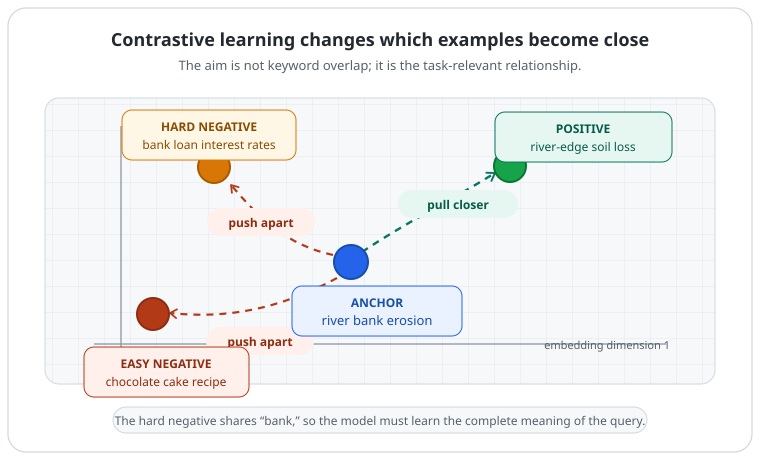
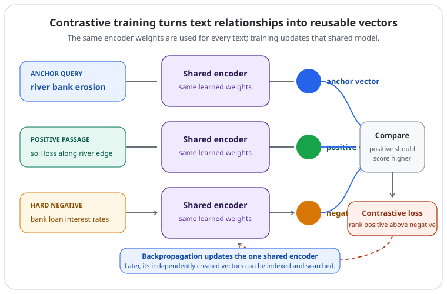

# Contrastive Learning

[](.)
[](.)
[](.)
[](#2-the-basic-training-example)

> Contrastive learning teaches a model which inputs should have similar representations and which should stay distinct.

An embedding is only useful when its distances mean something. Contrastive learning provides that learning signal: it brings related examples closer in the vector space and separates examples that should not match.

---

## Quick View

| Question | Simple answer |
| --- | --- |
| What is being learned? | A representation space where similarity supports the task |
| What is an anchor? | The example used as the starting point for a comparison |
| What is a positive? | An example that should match the anchor |
| What is a negative? | An example that should not match the anchor |
| What does the objective do? | Raises the positive's similarity relative to competing negatives |
| Why use temperature? | It controls how strongly the loss focuses on the most similar competitors |
| Main risk | Bad positives or false negatives teach the wrong geometry |
| Retrieval connection | Query and document encoders learn vectors that can be compared efficiently |

---

## Learning Flow

```text
examples with a meaningful relationship
→ encode each example into a vector
→ compare anchor-to-positive and anchor-to-negative similarities
→ reward the positive for ranking higher
→ update the encoder
→ shape a reusable embedding space
```

---

## 1. Why an Embedding Space Needs a Learning Signal

An encoder turns text, images, or other inputs into vectors. Before training, two vectors being close together does not automatically mean their inputs are related in a useful way.

For semantic search, we want a query and a relevant passage to have compatible vectors. We also want a query to remain distinct from a passage that shares a word but means something different.

```text
useful embedding space:
related inputs        → close together
task-relevant nonmatches → farther apart
```

Contrastive learning does not manually place every vector. Instead, it gives the model many comparison problems and adjusts the encoder so that the intended match scores higher than alternatives.

The word **contrastive** comes from learning by contrast: the model must distinguish what belongs with the anchor from what does not.

---

## 2. The Basic Training Example

For a retrieval example, suppose the anchor is a search query:

```text
anchor:        river bank erosion

positive:      A passage about soil being worn away along a river edge.

easy negative: chocolate cake recipe

hard negative: bank loan interest rates
```

The positive discusses the intended meaning. The easy negative is obviously unrelated. The hard negative shares the word `bank`, so the model must use `river` and `erosion` instead of matching one keyword.

```text
similarity(anchor, positive)      should increase
similarity(anchor, easy negative) should decrease
similarity(anchor, hard negative) should also decrease
```

<p align="center">
  
</p>
<p align="center"><em>Training changes the encoder so that the positive becomes the better match, even when a hard negative shares a misleading word.</em></p>

This is an intuition about the final space, not a rule that every unrelated pair must be far away in every direction. The useful geometry depends on the task and the similarity function used during training.

---

## 3. Similarity Is the Comparison Language

Each input passes through an encoder and becomes a vector. A contrastive objective compares the anchor vector with the other vectors using a similarity score.

For text embeddings, a common choice is **cosine similarity**:

```text
sim(u, v) = cosine(u, v)
```

Cosine similarity mainly compares direction. Two vectors pointing in a similar direction receive a higher score. A dot product is another common choice; when vectors are normalized, it is closely related to cosine similarity.

```text
anchor text    → encoder → vector a
positive text  → encoder → vector p
negative text  → encoder → vector n

compare: sim(a, p) and sim(a, n)
```

The important point is relative ranking. It is not enough for the positive to have a high score by itself: it should score higher than the competing negatives.

---

## 4. The Contrastive Objective and Temperature

One common batch-based form is called an **InfoNCE-style** objective. For anchor `i`, positive `i+`, and a set of candidate examples `C`, a compact form is:

```text
lossᵢ = -log(
  exp(sim(zᵢ, zᵢ₊) / τ)
  ─────────────────────────────────────────────
  Σₖ∈C exp(sim(zᵢ, zₖ) / τ)
)
```

You do not need to calculate this by hand to understand the goal:

- The numerator represents the intended positive match.
- The denominator contains that positive and all competing candidates.
- Lower loss means the positive received more of the score than the competitors.

`τ` (tau) is the **temperature**. It rescales similarity scores before the softmax-like comparison.

```text
lower temperature
→ larger differences between scaled scores
→ more attention on the closest, hardest competitors
```

A lower temperature can make hard negatives matter more, but it is not automatically better. Its useful value depends on the data, batch construction, encoder, similarity choice, and training setup.

---

## 5. Where Positives and Negatives Come From

The main design question is: *which pairs express the relationship we want the representation to preserve?*

### Supervised contrastive learning

Labels or curated pairs define the relationship. For example:

```text
question ↔ answer passage
paraphrase ↔ paraphrase
entailment pair ↔ positive pair
same class ↔ positive examples
different class ↔ negative examples
```

In supervised contrastive learning, an anchor can have more than one positive. For a class-labelled image dataset, all examples from the same class can be treated as positives for one another.

### Self-supervised contrastive learning

The data itself provides two related **views** of one example, without a human-provided class label.

```text
one image → two crops / colour changes → two views
one sentence → two dropout-based encoder passes → two views
image and its caption → two modalities describing related content
```

SimCLR is a well-known image example: carefully chosen image augmentations create two views. SimCSE is a text example: the same sentence is encoded twice with dropout enabled, producing two slightly different representations.

An augmentation is only a valid positive-making operation when it preserves what the task should consider the same. Cropping can be useful for an object-recognition image task, but aggressively deleting words may change a sentence's meaning and create a bad text positive.

---

## 6. Batch Negatives, Hard Negatives, and False Negatives

Training can compare an anchor with many candidates at once. In **in-batch negative** training, the positives for other examples in the batch often become negatives for this anchor.

```text
batch of query–passage pairs
→ each query has its own passage as positive
→ other batch passages become candidate negatives
```

This is efficient because one batch supplies many comparisons. It also creates a problem: another passage may actually be relevant to the current query. Treating that relevant passage as a negative is a **false negative**.

Hard negatives can teach useful fine distinctions, but they need care:

| Negative type | Example | What it teaches |
| --- | --- | --- |
| Easy negative | `chocolate cake recipe` | Broad topic separation |
| Hard negative | `bank loan interest rates` | Use the whole context, not one matching word |
| False negative | Another relevant river-erosion passage | Incorrectly pushes apart two things that should match |

Data quality is therefore part of the model design. More negatives are not automatically better if many of them contradict the desired meaning.

---

## 7. Why the Model Cannot Give Every Input the Same Vector

If every input received the same vector, all cosine similarities would be nearly identical. The model could not consistently make the positive rank above the negatives, so a contrastive objective with meaningful competitors penalizes this **representation collapse**.

```text
collapsed space:
all inputs → almost one point
→ no useful ranking between positive and negative

contrastive space:
matching inputs → compatible positions
nonmatches      → distinguishable positions
```

Avoiding collapse is not just a mathematical detail. It is why the training setup needs an informative comparison signal: valid positives, useful negatives, and a suitable objective.

---

## 8. From Training Comparisons to Retrieval

For a text embedding model, the same encoder can create vectors for queries and documents independently:

```text
query    → encoder → query vector
document → encoder → document vector
```

At search time, document vectors can be created in advance and stored in an index. A new query vector is then compared with them to retrieve promising candidates quickly.

<p align="center">
  
</p>
<p align="center"><em>The encoder learns from comparisons during training; later, the same independent vectors can support fast retrieval.</em></p>

This is the learning idea behind many [`embedding models and bi-encoders`](embedding-models-and-bi-encoders.md). It does not replace a [`cross-encoder`](rerankers-and-cross-encoders.md): a cross-encoder reads a candidate pair together and can inspect token-level interactions that a single vector may lose.

```text
bi-encoder + contrastive training
→ reusable vectors and fast candidate retrieval

cross-encoder
→ slower pairwise scoring, often used to rerank a small candidate set
```

The same general idea appears outside text retrieval. It can form image clusters, align images with captions, or provide features for another downstream task. What changes is the definition of a positive relationship.

---

## 9. Common Confusions

| Confusion | Correction |
| --- | --- |
| Contrastive learning only works without labels | It can be self-supervised or supervised; the difference is where the pair relationship comes from. |
| Every other item in a batch is truly negative | Some may be relevant false negatives, especially for broad queries or repeated labels. |
| A hard negative is bad data | It is an intentional nonmatch that is plausible enough to teach a finer distinction. |
| The goal is to make all negatives equally far away | The objective ranks the intended positive above competitors; useful geometry depends on the task. |
| More augmentation is always better | An augmentation must preserve the meaning the task is meant to keep. |
| Contrastive learning is a retrieval algorithm | It is a way to train representations; retrieval uses the learned vectors afterward. |
| Contrastive training makes rerankers unnecessary | Bi-encoders and cross-encoders make a speed-versus-interaction tradeoff and are often used together. |

---

## Related Papers

- [**Dimensionality Reduction by Learning an Invariant Mapping**](https://proceedings.mlr.press/v5/hadsell09a.html) — An early contrastive-loss formulation that learns to pull similar pairs together and separates dissimilar pairs by a margin.
- [**A Simple Framework for Contrastive Learning of Visual Representations (SimCLR)**](https://arxiv.org/abs/2002.05709) — Shows a simple self-supervised framework built from augmented image views, a contrastive loss, and a projection head.
- [**Momentum Contrast for Unsupervised Visual Representation Learning (MoCo)**](https://arxiv.org/abs/1911.05722) — Maintains a queue of encoded examples to provide a large, consistent set of contrastive keys.
- [**Supervised Contrastive Learning**](https://arxiv.org/abs/2004.11362) — Extends batch contrastive learning to class labels, bringing same-class representations together while separating classes.
- [**Sentence-BERT: Sentence Embeddings using Siamese BERT-Networks**](https://arxiv.org/abs/1908.10084) — Uses siamese and triplet structures to create sentence embeddings that can be compared efficiently.
- [**SimCSE: Simple Contrastive Learning of Sentence Embeddings**](https://aclanthology.org/2021.emnlp-main.552/) — Uses dropout-created views for unsupervised sentence embedding learning and NLI pairs for supervised learning.

## Related Concepts

- [`embedding-models-and-bi-encoders.md`](embedding-models-and-bi-encoders.md)
- [`rerankers-and-cross-encoders.md`](rerankers-and-cross-encoders.md)
- [`attention.md`](attention.md)

---

[](../README.md)
[](./)
[](embedding-models-and-bi-encoders.md)
[](https://arxiv.org/abs/2002.05709)
