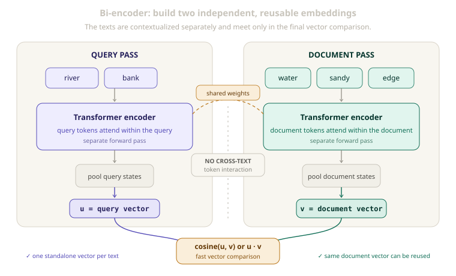
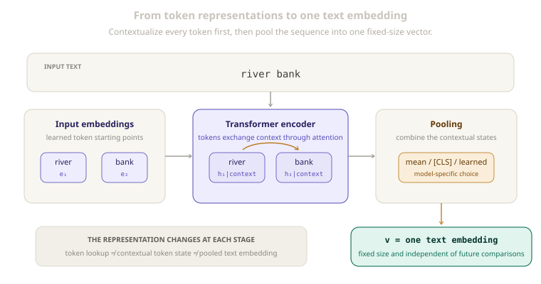

# Embedding Models and Bi-Encoders

[](.)
[](.)
[](.)
[](#3-from-token-states-to-one-text-vector)

> An embedding model turns one text into one vector that can be stored, reused, and compared with vectors from other texts.

The key idea is **independent encoding**: each representation is created from its own context before two texts are compared.

This is different from a [`cross-encoder`](rerankers-and-cross-encoders.md), which reads a text pair together and produces a score for that particular pair.

---

## Quick View

| Question | Answer |
| --- | --- |
| What goes in? | One text at a time |
| Where can attention flow? | Among tokens inside that text |
| What comes out? | One fixed-size vector per text |
| What does bi-encoder mean? | Two texts pass through separate encoder computations |
| How are texts compared? | Usually cosine similarity or a dot product |
| What is the useful property? | A text vector does not depend on its future comparison partner |
| Main tradeoff | Efficient comparison, but no token-level interaction between the two texts |

---

## Learning Flow

```text
tokens
→ input embeddings
→ contextual token states
→ pooling
→ one text embedding
→ compare with another independently created embedding
```

---

## 1. Token Embeddings Are Only the Starting Point

At the input, the model looks up a learned vector for each token. Transformer layers then update it using the surrounding tokens.

```text
token ID
→ input embedding
→ Transformer layers
→ contextual token state
```

Consider the word `bank`:

```text
The bank is closed on Sunday.
The river bank is muddy after the rain.
```

The input lookup for `bank` begins from the same learned representation. Its later state changes because attention brings in different context: `closed` supports the financial meaning, while `river` and `muddy` support the geographical meaning.

```text
input embedding       = starting representation of a token
contextual token state = token representation after using context
text embedding         = one vector summarizing the sequence
```

---

## 2. A Bi-Encoder Processes Texts Separately

Suppose a system needs to compare a query `q` with a document `d`.

A bi-encoder creates their representations in separate forward passes:

```text
q → encoder → query vector u
d → encoder → document vector v
```

```text
u = f(q)
v = f(d)
```

The two towers often share learned weights: the same model `f` is applied twice, but the token computations remain separate. Some systems instead use different query and document encoders, called an **asymmetric bi-encoder**. In both cases, the texts are not joined inside one Transformer pass.

Inside the model:

```text
query tokens    ↔ other query tokens
document tokens ↔ other document tokens

not during encoding:
query tokens    ↔ document tokens
```

<p align="center">
  
</p>
<p align="center"><em>Separate encoding means each vector is created without seeing the text it may later be compared with.</em></p>

---

## 3. From Token States to One Text Vector

After the encoder, there is still one contextual state per token. An embedding model needs a pooling step to turn the sequence into one fixed-size vector.

Common pooling choices include:

| Pooling method | Basic idea |
| --- | --- |
| Mean pooling | Average the token states, usually ignoring padding |
| Special-token pooling | Use a designated sequence token such as `[CLS]` |
| Learned pooling | Train an additional mechanism to combine token states |

The pooling choice must match how the model was trained. An arbitrary Transformer hidden state is not automatically a useful sentence embedding.

<p align="center">
  
</p>
<p align="center"><em>The final embedding summarizes the whole text; it is not simply the original vector for one word.</em></p>

---

## 4. Standalone Vectors and Similarity

A vector is standalone when it depends only on the text being encoded.

```text
u = f(q)
v = f(d)
```

Once `v` has been created, it can be compared with many query vectors without being rebuilt for each comparison partner.

Two common comparison functions are:

```text
cosine similarity = cosine(u, v)
dot-product score = u · v
```

Cosine similarity focuses on vector direction. A dot product also uses magnitude unless the vectors are normalized. The comparison method is part of the training setup, not an interchangeable final detail.

The text is now a point in a learned space, where related texts should appear closer under the chosen similarity function.

---

## 5. Difference from a Cross-Encoder

Consider this pair:

```text
Query:     river bank
Document:  The water rose near the sandy edge.
```

The query encoder connects `river` with `bank`, while the document encoder connects `water`, `sandy`, and `edge`. But `bank` cannot attend directly to `water` or `edge`; the texts meet only when their finished vectors are compared.

```text
bi-encoder:
encode separately → compare representations

cross-encoder:
join the pair → build interaction → score the pair
```

This compression creates reusable representations, but exact alignment, negation, or small wording differences may be difficult to preserve in one vector.

The joint alternative is explained in [`Rerankers and Cross-Encoders`](rerankers-and-cross-encoders.md).

---

## 6. How the Embedding Space Is Learned

An embedding model must learn which texts should be close and which should be far apart.

A simplified training example contains:

```text
anchor text
positive text: related to the anchor
negative text: not the intended match
```

A **contrastive objective** rewards the model when the anchor is closer to the positive than to the negatives, shaping the geometry of the embedding space.

The choice of negatives matters. Random negatives may be too easy. **Hard negatives** look plausible but are still incorrect, giving the model a finer distinction to learn.

For example:

```text
query: river bank erosion

easy negative: chocolate cake recipe
hard negative: bank loan interest rates
```

Because the hard negative shares `bank`, the model must use the complete context. Embedding quality therefore depends on the training pairs, negatives, pooling method, and similarity objective—not only the encoder architecture.

---

## 7. Representative Models

These models illustrate different uses of independent text representations:

| Model | Main learning point |
| --- | --- |
| **Sentence-BERT (SBERT)** | Uses siamese or triplet structures so sentence vectors can be compared efficiently |
| **Dense Passage Retrieval (DPR)** | Uses separate question and passage encoders for open-domain question answering |
| **E5** | Treats many text-embedding tasks through a shared contrastive-learning formulation |

Their architectures and training differ, but all produce vectors that can be computed independently. Models such as **ColBERT** instead keep token-level vectors for **late interaction**, forming a middle point between single-vector comparison and full joint encoding.

---

## 8. Common Confusions

| Confusion | Correction |
| --- | --- |
| An embedding model has no attention | Transformer embedding models use self-attention within each input text |
| Two towers always mean two different models | The towers commonly share weights, although asymmetric encoders also exist |
| A token embedding and a sentence embedding are the same | Token lookups are inputs; a sentence embedding summarizes contextual token states |
| Any `[CLS]` hidden state is a good embedding | Pooling becomes useful through the model's training objective and architecture |
| Similarity is computed inside the Transformer | In a bi-encoder, finished vectors are normally compared after separate encoding |
| A standalone vector never changes | It is independent of the comparison partner, but it changes if the model or text changes |
| Hard negatives are incorrect training data | They are intentionally difficult non-matches used to teach finer distinctions |

---

## Related Papers

- [**Sentence-BERT: Sentence Embeddings using Siamese BERT-Networks**](https://arxiv.org/abs/1908.10084) - Learns sentence representations that can be compared without jointly encoding every pair.
- [**Dense Passage Retrieval for Open-Domain Question Answering**](https://arxiv.org/abs/2004.04906) - Uses independently encoded questions and passages for dense retrieval.
- [**Text Embeddings by Weakly-Supervised Contrastive Pre-training**](https://arxiv.org/abs/2212.03533) - Introduces the E5 family and a shared contrastive view of text embedding tasks.
- [**ColBERT: Efficient and Effective Passage Search via Contextualized Late Interaction over BERT**](https://arxiv.org/abs/2004.12832) - Preserves token-level representations and applies late interaction.

## Related Concepts

- [`rerankers-and-cross-encoders.md`](rerankers-and-cross-encoders.md)
- [`attention.md`](attention.md)
- [`positional-encoding.md`](positional-encoding.md)

---

[](../README.md)
[](./)
[](rerankers-and-cross-encoders.md)
[](https://arxiv.org/abs/1908.10084)
