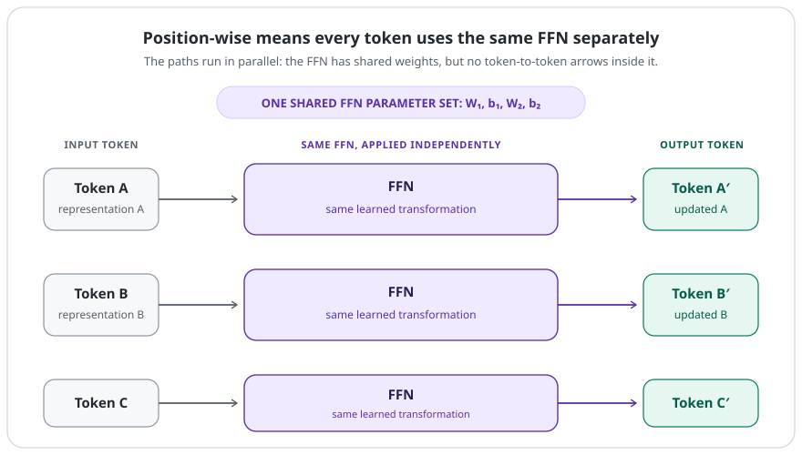
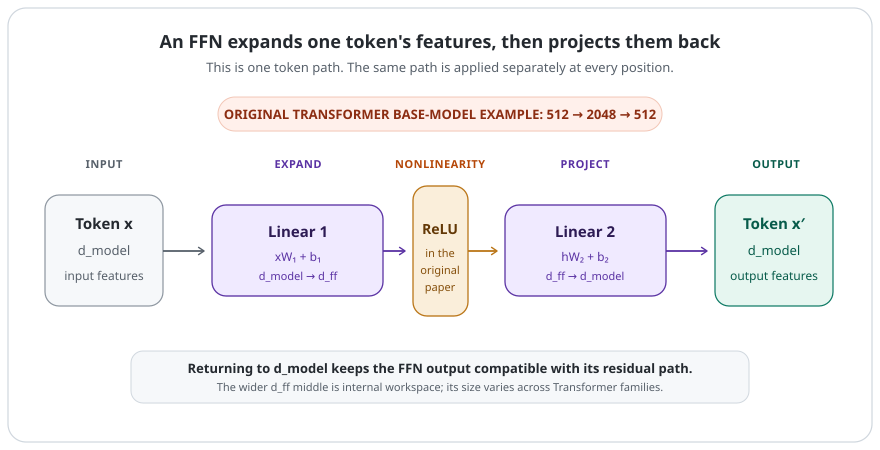

# Feed-Forward Networks in Transformers

[](.)
[](transformers.md)
[](.)
[](https://arxiv.org/abs/1706.03762)

> A Transformer FFN applies the same nonlinear network to every token representation separately.

Attention and the feed-forward network (FFN) have different jobs. Attention lets tokens use information from other positions. The FFN then takes each updated token representation and transforms its hidden features on its own.

```text
Attention → mixes information across token positions

FFN → transforms each token's hidden features independently
```

---

## Quick View

| Question | Simple answer |
| --- | --- |
| What is it? | A position-wise neural network inside each Transformer block |
| Where does it act? | On one token representation at a time |
| Are its weights shared across positions? | Yes, within one Transformer layer |
| Does it mix tokens? | No; attention does that job |
| Typical shape | `d_model → d_ff → d_model` |
| Original base-model example | `512 → 2048 → 512` |

---

## Learning Flow

```text
attention updates each token with context
→ each token enters the same FFN separately
→ expand hidden features
→ apply a nonlinearity
→ project back to the model dimension
→ continue through the Transformer block
```

---

## 1. Why Attention Needs an FFN Too

Attention answers a sequence question: **which other token positions should help update this token?** It mixes information between positions.

That is useful, but mixing is not the whole computation. After a token has collected context, the model still needs to transform and combine the features inside that token's own hidden vector. The FFN is the part that does this token-wise processing.

```text
Attention: "What information should this token receive from elsewhere?"

FFN:       "How should this token's updated features be transformed?"
```

The two operations are repeated in every Transformer block, so later attention layers can work with token representations that earlier FFNs have already transformed.

---

## 2. What “Position-Wise” Means

In the original Transformer, the FFN is applied **separately and identically** at every token position. “Identically” means Token A, Token B, and Token C use the same learned weights in that layer. “Separately” means no information moves from A to B inside the FFN.

<p align="center">
  
</p>
<p align="center"><em>One shared FFN, run independently for every token position.</em></p>

The outputs still differ. Each token arrives with a different representation—often because attention has already given it different context—so the same function can produce a different result for each token.

This shared computation is parallel-friendly: all token vectors can be put into a matrix and processed together, while the math still acts row by row.

---

## 3. The Original FFN Shape

The original paper writes the FFN as:

```text
FFN(x) = max(0, xW₁ + b₁)W₂ + b₂
```

For one token vector `x`, the steps are:

1. In the original Transformer, the first linear layer projects from `d_model` to the wider intermediate dimension `d_ff`.
2. A nonlinear activation, ReLU in the original paper, changes the features in a way two linear layers alone cannot.
3. A second linear layer projects back from `d_ff` to `d_model`.

<p align="center">
  
</p>
<p align="center"><em>The original base Transformer expands from <code>d_model = 512</code> to an intermediate <code>d_ff = 2048</code>, then projects back to <code>d_model</code>; these dimensions are design choices, not a universal rule.</em></p>

For the original Transformer base model, this was:

```text
512 → 2048 → 512
```

Those numbers are historical settings, not a requirement for every Transformer. Different model families choose different widths and FFN designs.

### Why the nonlinearity matters

If the middle activation were removed, the two linear layers could be combined into one linear transformation. The nonlinear step lets the FFN represent richer, input-dependent changes to a token's features.

### Why return to `d_model`?

The FFN ends at `d_model` so its output has the same shape as the representation entering the sublayer. That makes the residual addition around the FFN possible. [`residual-connections.md`](residual-connections.md) explains that shortcut path; [`layer-normalization.md`](layer-normalization.md) explains the normalization placed around Transformer sublayers.

---

## 4. FFN and Attention Work Together

| Component | Main job | Mixes information between token positions? |
| --- | --- | --- |
| Attention | Choose and combine useful context | Yes |
| FFN | Nonlinearly transform one token's hidden features | No |

An FFN is not less important just because it does not connect tokens. Attention gives a representation context; the FFN gives the model another learned way to process that contextual representation before the next block.

In the original Transformer, each encoder layer has attention followed by an FFN, with a residual connection and LayerNorm around each sublayer. The decoder uses the same FFN pattern after its attention sublayers. See [`transformers.md`](transformers.md) for the block overview and [`architecture.md`](../papers/nlp-llms/attention-is-all-you-need/architecture.md) for the original encoder-decoder layout.

---

## 5. Brief Modern Context

The original Transformer used ReLU between its two linear layers. Later Transformer designs often use alternatives such as GELU, or gated FFNs including GEGLU and SwiGLU.

The important idea stays the same: each layer has a token-wise nonlinear transformation between attention operations. Gated variants change the internal FFN calculation; they do not turn the FFN into a cross-token mixing operation.

Also, each Transformer layer has its **own** FFN parameters. The weights are shared across positions *within* a layer, not across every layer in the stack.

---

## Common Confusions

| Confusion | Correction |
| --- | --- |
| The FFN lets Token A directly use Token B | No. Attention mixes information between positions; the FFN processes each resulting token vector separately. |
| Position-wise means each token has its own FFN weights | No. Positions share one FFN's weights within a layer. |
| Shared weights mean all tokens get the same output | No. The inputs differ, so the same function can return different outputs. |
| Every Transformer layer uses one global FFN | No. Each layer has its own learned FFN parameters. |
| `512 → 2048 → 512` is the standard rule | It is the original base-model example; modern models choose their own dimensions and variants. |
| The FFN is just an optional MLP after attention | It is a standard learned sublayer in the original Transformer block and complements attention's different job. |

---

## Related Papers

- [**Attention Is All You Need**](https://arxiv.org/abs/1706.03762) — Defined the original position-wise FFN, including the ReLU form and the base-model `d_model = 512`, `d_ff = 2048` dimensions.
- [**GLU Variants Improve Transformer**](https://arxiv.org/abs/2002.05202) — Evaluated gated FFN variants in Transformer feed-forward sublayers and reported improvements over typical ReLU or GELU activations in its experiments.

## Related Concepts

- [`transformers.md`](transformers.md)
- [`attention.md`](attention.md)
- [`residual-connections.md`](residual-connections.md)
- [`layer-normalization.md`](layer-normalization.md)
- [`architecture.md`](../papers/nlp-llms/attention-is-all-you-need/architecture.md) — detailed original-paper architecture

## Questions Worth Testing

- How does changing `d_ff` change a small Transformer's parameter count and training behavior?
- How do ReLU, GELU, and a gated FFN compare when the rest of a small Transformer is fixed?

---

[](../README.md)
[](./)
[](transformers.md)
[](https://arxiv.org/abs/1706.03762)
