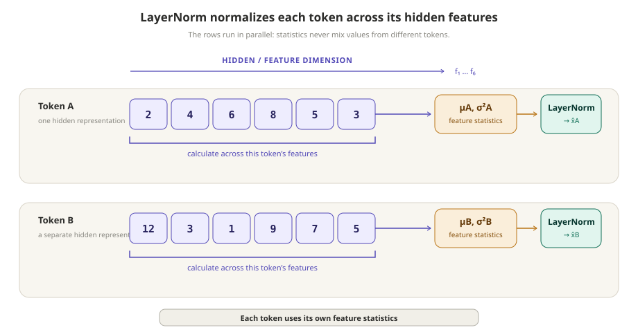
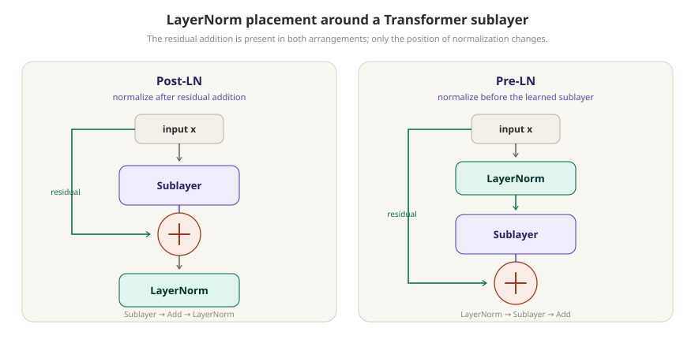

# Layer Normalization

[](.)
[](transformers.md)
[](.)
[](https://arxiv.org/abs/1607.06450)

> LayerNorm rescales one representation using statistics computed from that representation's own hidden features.

In a Transformer, each token has a hidden vector. LayerNorm looks across the values inside one such vector, recenters and rescales them, then applies a learned scale and shift. It does not calculate one set of statistics across all token positions or the whole batch.

<p align="center">
  
</p>
<p align="center"><em>LayerNorm computes feature statistics separately for every representation.</em></p>

---

## Quick View

| Question | Simple answer |
| --- | --- |
| What is normalized? | The features within one hidden representation |
| Statistics | Mean and variance across the hidden dimension |
| Shared across tokens? | No; every token gets its own statistics |
| Learned parameters | Per-feature scale `γ` and shift `β` |
| Transformer role | Helps keep stacked activations well behaved during training |
| Common placements | After residual addition (Post-LN) or before a sublayer (Pre-LN) |

---

## Learning Flow

```text
one token's hidden vector
→ mean and variance across its features
→ normalize that vector
→ learned scale and shift
→ representation passed to the next computation
```

---

## 1. The Central Idea: Normalize Across Features

Suppose a layer holds representations for several tokens. For one token at position `t`, write its hidden vector as:

```text
xₜ = [xₜ,1, xₜ,2, ..., xₜ,d]
```

`d` is the hidden dimension. LayerNorm computes the mean and variance using the `d` features in that one row:

```text
xₜ,1  xₜ,2  ...  xₜ,d
 └───────────────┘
      one token
```

The next token uses its own vector and therefore its own mean and variance. This distinction is especially useful in Transformer diagrams: attention mixes information between positions, while LayerNorm normalizes the resulting representation at each position independently.

For a tensor shaped `[batch, sequence, hidden]`, the usual Transformer LayerNorm operates over the final `hidden` dimension. The same operation is applied at every batch item and token position, but the statistics are not pooled between them.

---

## 2. The Formula

For one hidden vector `x` with `d` features, LayerNorm first calculates:

```text
μ = (1 / d) Σᵢ xᵢ
σ² = (1 / d) Σᵢ (xᵢ - μ)²
```

It then normalizes each feature:

```text
x̂ᵢ = (xᵢ - μ) / √(σ² + ε)
```

`ε` is a small constant that prevents division by zero and improves numerical stability.

The normalized vector has mean near zero and variance near one across its features. That is a description of the intermediate normalized values, not a claim that every individual feature has mean zero across a dataset.

---

## 3. Learned Scale and Shift

LayerNorm usually does not stop at `x̂`. It gives the model a learned scale and shift for each hidden feature:

```text
yᵢ = γᵢx̂ᵢ + βᵢ
```

`γ` and `β` have the hidden dimension's shape. They are learned parameters shared across positions in the layer, while `μ` and `σ²` are recomputed from each individual representation.

This matters because normalization does not permanently force the model to use zero-centered, unit-variance activations. The learned affine transformation can adjust the representation to what the surrounding network needs.

---

## 4. LayerNorm in a Transformer Block

LayerNorm is commonly drawn next to a residual connection, but the two operations have separate jobs:

```text
residual connection: x + Sublayer(x)
LayerNorm:          normalize one resulting representation across features
```

The original Transformer used **Post-LN**, placing normalization after residual addition:

```text
LayerNorm(x + Sublayer(x))
```

Many later designs use **Pre-LN**, where LayerNorm comes before the learned sublayer. Both arrangements retain a residual path.

<p align="center">
  
</p>
<p align="center"><em>The diagrams differ only in where normalization sits relative to the learned sublayer and residual addition.</em></p>

The placement can affect optimization and training behavior, but the picture alone does not establish that one arrangement is universally better. The model family, initialization, learning-rate schedule, and other design choices also matter.

---

## 5. LayerNorm Is Not BatchNorm

BatchNorm and LayerNorm both use normalization, but they choose their statistics from different axes.

| Method | Statistics are computed across | Consequence for a token representation |
| --- | --- | --- |
| LayerNorm | Its own hidden features | Can be evaluated independently of other examples or positions |
| BatchNorm | Batch-dependent activations | Depends on values from other examples during training |

The exact axes used by a normalization layer depend on the tensor layout and implementation. The stable mental model for Transformer LayerNorm is: *for each token, normalize across its hidden features.*

---

## 6. Common Misconceptions

| Confusion | Correction |
| --- | --- |
| LayerNorm normalizes a token across all other tokens | It computes statistics from the token's own hidden features. |
| LayerNorm and residual addition are the same operation | A residual path adds values; LayerNorm rescales a representation. |
| All tokens receive identical normalized values | The same operation is used at each position, but each token has different inputs and statistics. |
| `γ` and `β` are recomputed for every token | They are learned model parameters; the mean and variance are the per-token quantities. |
| Normalization guarantees training will be stable | It can help, but training also depends on architecture, initialization, optimization, and data. |

---

## 7. What LayerNorm Does Not Do

LayerNorm does not mix information between token positions. If one token needs information from another token, attention is the component that provides that interaction. LayerNorm instead transforms the scale and center of the representation that reaches it.

It also does not make every hidden vector identical. After feature-wise normalization, the relative pattern of values remains available, and the learned `γ` and `β` parameters can reshape the output further.

## Related Papers

- [**Layer Normalization**](https://arxiv.org/abs/1607.06450) — Introduced normalization using statistics computed within individual layer inputs.
- [**Attention Is All You Need**](https://arxiv.org/abs/1706.03762) — Used residual connections followed by LayerNorm around each encoder and decoder sublayer in the original Transformer.
- [**On Layer Normalization in the Transformer Architecture**](https://arxiv.org/abs/2002.04745) — Analyzed the effect of LayerNorm placement in Transformer training.

## Related Concepts

- [`transformers.md`](transformers.md)
- [`residual-connections.md`](residual-connections.md)
- [`attention.md`](attention.md)
- [`feed-forward-networks.md`](feed-forward-networks.md)
- [`architecture.md`](../papers/nlp-llms/attention-is-all-you-need/architecture.md) — detailed original-paper architecture

---

[](../README.md)
[](./)
[](transformers.md)
[](https://arxiv.org/abs/1607.06450)
