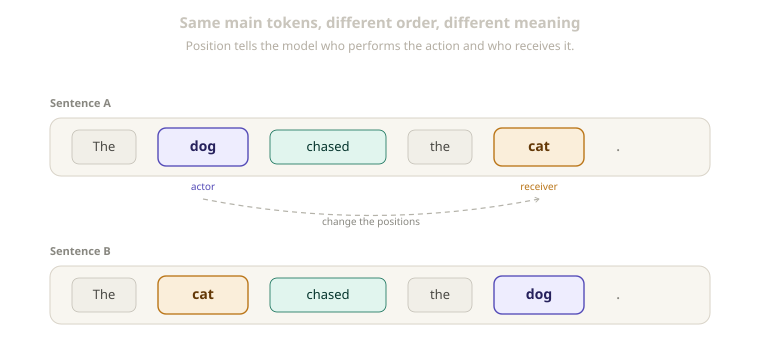
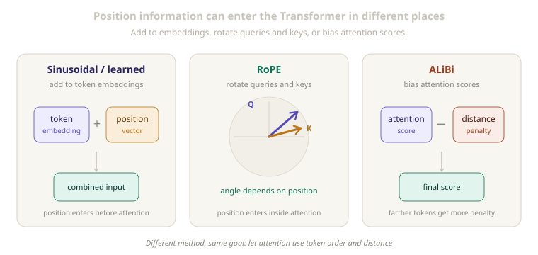

# Positional Encoding in Transformers

[](.)
[](../papers/nlp-llms/attention-is-all-you-need/architecture.md)
[](.)
[](https://arxiv.org/abs/1706.03762)

> Self-attention can identify relationships between tokens, but it does not naturally know the order in which those tokens appear.

Attention tells the model which tokens are related.

Positional information tells the model where those tokens appear.

These two sentences use nearly the same tokens:

```text
The dog chased the cat.

The cat chased the dog.
```

Their order changes who is chasing whom, so their meanings are different.

Positional encoding gives a Transformer information about where each token appears in the sequence. It lets attention use both token meaning and token order.

<p align="center">
  
</p>
<p align="center"><em>The tokens are similar, but changing their positions changes the meaning.</em></p>

---

## Quick View

| Question | Answer |
| --- | --- |
| Main problem | Self-attention does not naturally represent token order |
| Basic solution | Add position information to token representations |
| Original Transformer method | Sinusoidal positional encoding |
| Learned method | Learned positional embeddings |
| Relative method | Represent distance between tokens |
| Common modern method | RoPE |
| Another long-context method | ALiBi |
| Why it matters | Word order and distance affect meaning |

---

## Learning Flow

```text
tokens
→ token embeddings
→ add position information
→ self-attention can use content and order
→ contextual token representations
```

The main positional methods developed from simple absolute positions toward methods that work directly inside attention:

```text
absolute positions
→ learned positions
→ relative positions
→ RoPE
→ ALiBi
→ longer context windows
```

---

## 1. Why Token Order Matters

Language meaning depends on two things:

```text
what the tokens are
+
where the tokens appear
```

Consider these sentences:

```text
The teacher praised the student.

The student praised the teacher.
```

They contain almost the same words.

The word order tells us who performed the action and who received it.

Position also helps with distance and direction.

```text
The animal did not cross the street because it was tired.
```

The word `it` is more likely connected to `animal` than to `street`.

To learn useful language patterns, a model needs clues about:

- which token came first
- which token came later
- how far apart two tokens are
- whether one token is before or after another

---

## 2. Why Self-Attention Does Not Know Order

As explained in [`attention.md`](attention.md), self-attention compares queries and keys to decide which tokens are related.

The Transformer uses this formula:

```text
Attention(Q, K, V) = softmax(QKᵀ / √dₖ) V
```

The formula compares token representations, but it does not contain token positions by itself.

```text
Input A:
[dog] [chased] [cat]

Input B:
[cat] [chased] [dog]

Token content is similar.
Token order is different.
```

Without positional information, attention sees token content, but it does not naturally know whether a token came first, second, or last.

RNNs process tokens one after another:

```text
token 1 → token 2 → token 3
```

This step-by-step computation naturally includes sequence order.

Transformers process all tokens in parallel:

```text
token 1 ┐
token 2 ├→ self-attention
token 3 ┘
```

Parallel processing is useful, but it means position information must be added explicitly.

More formally, self-attention without position information is **permutation equivariant**. In simple English, rearranging the input tokens only rearranges the corresponding outputs; attention alone receives no separate clue about the original order.

---

## 3. Adding Position to Token Embeddings

The original Transformer uses a simple idea:

```text
input representation
=
token embedding
+
positional encoding
```

For example:

```text
embedding for "cat"
+
encoding for position 3
=
input representation for "cat" at position 3
```

The same word receives a different input representation when it appears at a different position.

| Information | Meaning |
| --- | --- |
| Token embedding | What the token means |
| Positional encoding | Where the token appears |
| Combined representation | Token meaning with position information |

The combined representation is passed into the Transformer layers.

This lets self-attention compare tokens while also using clues about their positions.

---

## 4. Sinusoidal Positional Encoding

The original Transformer generated position patterns using sine and cosine functions.

```text
PE(pos, 2i) = sin(pos / 10000^(2i / d_model))

PE(pos, 2i + 1) = cos(pos / 10000^(2i / d_model))
```

The symbols have simple meanings:

| Symbol | Meaning |
| --- | --- |
| `pos` | The token position |
| `i` | The embedding dimension index |
| `d_model` | The model embedding size |
| `sin` | Used for some dimensions |
| `cos` | Used for the other dimensions |

The formulas do not need to be derived to understand their purpose.

Each position receives its own pattern:

```text
position 0 → one sine/cosine pattern
position 1 → a slightly different pattern
position 2 → another pattern
```

Different dimensions change at different speeds. Together, they provide a structured signal that distinguishes positions while giving nearby positions related patterns.

The encoding is fixed. It is generated mathematically rather than learned from training data.

| Advantages | Limitations |
| --- | --- |
| No additional learned parameters | Uses a fixed mathematical pattern |
| Simple and deterministic | Adds position directly to token embeddings |
| Used in the original Transformer | Generating longer positions does not guarantee the model understands much longer sequences |
| Can be calculated for different sequence lengths | The model may still struggle beyond lengths seen during training |

---

## 5. Learned Positional Embeddings

Instead of using fixed sine and cosine functions, a model can learn one vector for each position.

```text
position 0 → learned vector
position 1 → learned vector
position 2 → learned vector
...
```

The model still combines token and position information:

```text
token embedding + learned position vector
```

The position vectors are updated during training, just like other learned model parameters.

BERT is a well-known model that uses learned absolute positional embeddings.

| Advantages | Limitations |
| --- | --- |
| Learns useful position representations from data | Usually has a fixed maximum position table |
| Simple to understand and implement | Positions outside the table are not directly learned |
| Can work well for a fixed sequence length | Extending context may require changing and retraining the table |

Learned positions are not always better or worse than sinusoidal positions.

They are a different design choice with different strengths and limitations.

---

## 6. Relative Positional Encoding

Absolute and relative position answer different questions:

```text
Absolute position:
The token is at position 10.

Relative position:
The token is 2 positions before another token.
```

Many language relationships depend more on relative distance than on an exact position number.

```text
"The cat is sleeping."

The relationship between "cat" and "sleeping"
is useful near the start or near the end of a sentence.
```

A simple way to describe relative distance is:

```text
relative distance = key position - query position
```

The sign can tell the model whether the key is before or after the query. The size can tell it how far apart they are.

Relative positional methods add this information during the attention calculation.

Different Transformer models implement relative position information in different ways. They share the idea of representing token-to-token distance, but they do not all use the same mechanism.

---

## 7. Rotary Position Embeddings (RoPE)

RoPE means:

```text
Rotary Position Embeddings
```

Its main difference is where position information is applied:

```text
Sinusoidal and learned positions:
add position information to token embeddings

RoPE:
apply a position-based rotation to query and key vectors
```

Imagine each query and key vector being turned by an angle based on its token position.

```text
query at position 2 → rotated using position 2
key at position 5   → rotated using position 5

their comparison contains information
about the distance between positions 2 and 5
```

When the rotated query and key are compared, their interaction carries relative-position information.

RoPE is commonly used in decoder-only language models because it works naturally with causal self-attention.

| Advantages | Limitations |
| --- | --- |
| Position directly affects attention | Quality may fall far beyond the training length |
| Naturally represents relative distance | Longer context often needs scaling or more training |
| Works well with causal self-attention | Requires more care than adding a position vector |
| Widely used in modern LLMs | Does not provide unlimited context by itself |

---

## 8. ALiBi

ALiBi means:

```text
Attention with Linear Biases
```

ALiBi gives attention scores a distance-based penalty.

```text
normal attention score
-
distance penalty
=
final attention score
```

Nearby tokens receive a smaller penalty. Farther tokens receive a larger negative bias.

```text
near token → small penalty
far token  → larger penalty
```

Different attention heads can use different penalty strengths.

Some heads may focus more strongly on nearby tokens, while others can look farther back.

The difference from RoPE is simple:

```text
RoPE changes queries and keys.

ALiBi changes attention scores.
```

<p align="center">
  
</p>
<p align="center"><em>The methods provide position information at different points in the Transformer.</em></p>

| Advantages | Limitations |
| --- | --- |
| Simple idea | Adds a preference for closer tokens |
| Does not need a position embedding table | May not be the best choice for every task |
| Can generalize to longer inputs better than some absolute methods | Does not remove the cost of long attention |

---

## 9. Comparing the Methods

| Method | Main idea | Position added where? | Learned? | Main strength | Main limitation |
| --- | --- | --- | --- | --- | --- |
| Sinusoidal | Fixed sine and cosine patterns | Token embeddings | No | Simple and deterministic | Fixed pattern |
| Learned embeddings | Learn a vector for each position | Token embeddings | Yes | Learns from data | Usually limited to trained positions |
| Relative position | Represent distance between tokens | Attention calculation | Often | Models token relationships directly | More complex |
| RoPE | Rotate queries and keys by position | Queries and keys | Mostly fixed method | Strong relative-position behavior | Needs care for longer contexts |
| ALiBi | Penalize attention by distance | Attention scores | Mostly no | Simple length extrapolation idea | Adds distance preference |

There is no single positional method that is best for every Transformer.

The choice depends on:

- model architecture
- task
- training length
- target context length
- available compute
- whether the model is trained from scratch or extended later

---

## 10. Positional Encoding and Long Context

Long-context discussions often use three different ideas:

| Term | Simple meaning |
| --- | --- |
| Training context length | Sequence lengths the model saw during training |
| Maximum context length | Input length the system allows |
| Effective context length | Amount of context the model can use reliably |

These lengths are not always the same.

```text
A model may accept 32,000 tokens,
but that does not mean it uses every token equally well.
```

When a model receives positions much longer than those seen during training, the position patterns may be unfamiliar.

For RoPE-based models, common high-level approaches include:

- RoPE scaling
- position interpolation
- continued long-context training

These approaches help adapt position handling, but they do not automatically make every part of a model effective at long context.

Other important factors include:

```text
attention memory
training data
KV cache size
retrieval ability
model architecture
long-context evaluation
```

Longer sequences also require more memory and computation with standard self-attention.

The main distinction is:

```text
positional encoding helps represent order

but it does not by itself solve
all long-context problems
```

---

## 11. Common Confusions

| Confusion | Correction |
| --- | --- |
| Self-attention automatically understands word order | It needs positional information |
| Position encoding changes the token itself | It changes the representation used by the model |
| Sinusoidal encoding is learned | It is generated using fixed mathematical functions |
| Learned positions are always better | Each method has strengths and limitations |
| Relative position only means absolute token numbers | It focuses on distance and direction between tokens |
| RoPE adds a position vector to token embeddings | It rotates query and key vectors |
| ALiBi is another embedding table | It adds a bias to attention scores |
| RoPE gives unlimited context | Longer context still requires training and careful scaling |
| A larger context window always means better understanding | Allowed input length and effective understanding are different |
| Positional encoding makes attention cheaper | It adds order information but does not reduce standard attention complexity |

---

## Related Papers

- [**Attention Is All You Need**](https://arxiv.org/abs/1706.03762) - Introduced the Transformer and its sinusoidal positional encoding.
- [**Self-Attention with Relative Position Representations**](https://arxiv.org/abs/1803.02155) - Added relative distance information to self-attention.
- [**BERT: Pre-training of Deep Bidirectional Transformers for Language Understanding**](https://arxiv.org/abs/1810.04805) - Used learned absolute positional embeddings in a widely adopted encoder model.
- [**RoFormer: Enhanced Transformer with Rotary Position Embedding**](https://arxiv.org/abs/2104.09864) - Introduced RoPE as a way to apply position through query and key rotations.
- [**Train Short, Test Long: Attention with Linear Biases Enables Input Length Extrapolation**](https://arxiv.org/abs/2108.12409) - Introduced ALiBi distance biases for attention scores.

## Related Concepts

- [`attention.md`](attention.md)

---

[](../README.md)
[](./)
[](attention.md)
[](https://arxiv.org/abs/1706.03762)
