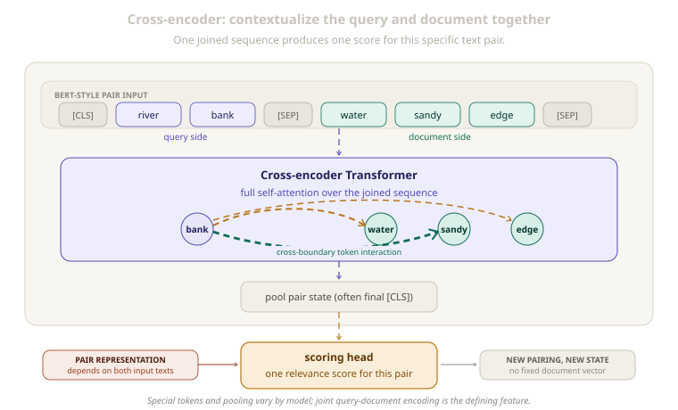
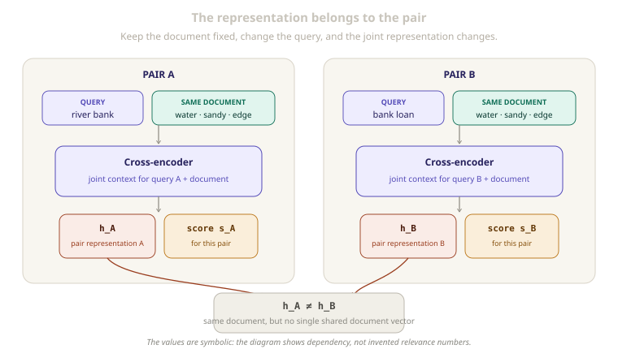

# Rerankers and Cross-Encoders

[](.)
[](.)
[](.)
[](#6-retrieval-and-reranking)

> A cross-encoder reads two texts together, lets their tokens interact, and produces a score for that specific pair.

An [`embedding model`](embedding-models-and-bi-encoders.md) compresses each text independently. That makes its vectors reusable, but the query and document cannot examine each other token by token inside the model.

A cross-encoder removes that separation, allowing a more detailed pairwise judgment.

---

## Quick View

| Question | Answer |
| --- | --- |
| What goes in? | Two texts joined as one model input |
| Where can attention flow? | Across the joined sequence in a full-attention encoder |
| What comes out? | One score for the pair |
| What does the score describe? | The relationship between those two inputs |
| Is there a standalone document embedding? | Not from the pairwise representation |
| Why use it after retrieval? | It can inspect a small candidate set more closely |
| Main tradeoff | Rich interaction, but a new model evaluation is needed for each pair |

---

## Learning Flow

```text
query + document
→ one joined token sequence
→ cross-boundary self-attention
→ pair representation
→ scoring head
→ relevance score
```

---

## 1. Why Independent Vectors Can Miss Details

Consider a query and document:

```text
Query:     river bank
Document:  The water rose near the sandy edge.
```

A bi-encoder can place `river bank` and `sandy edge` near each other in an embedding space. However, each text is compressed before comparison, so `bank` never directly attends to `water` or `edge` while its representation is built.

A single vector may preserve broad meaning while losing fine interaction. This matters with:

- a negation such as `not`
- an exact requirement or number
- an ambiguous word resolved by the other text
- similar vocabulary with a different meaning

---

## 2. A Cross-Encoder Joins the Pair

A BERT-style cross-encoder may format the inputs as:

```text
[CLS] river bank [SEP] The water rose near the sandy edge [SEP]
```

`[CLS]` and `[SEP]` are a BERT-style example, not a rule for every reranker.

The important part is that both texts form one sequence. In a bidirectional full-attention encoder, tokens exchange information across the query-document boundary.

```text
query token ↔ document token
```

The representation of `bank` can now use `water`, `sandy`, and `edge`; document-token states are also updated for this query.

<p align="center">
  
</p>
<p align="center"><em>The model forms a representation of the relationship, not a reusable representation of either text alone.</em></p>

The attention paths are intuition, not a complete explanation. The score depends on all layers, heads, residual connections, and learned projections.

---

## 3. From Joint Context to a Score

The Transformer produces a state for every position. A scoring head needs one representation of the pair.

In BERT-style models, the final `[CLS]` state is often used:

```text
pair state h = g(query, document)
score s = scoring_head(h)
```

Other models may pool differently or generate a relevance token. The main idea remains: the score comes from a jointly processed pair.

The output is not automatically a probability. It may be:

| Output | Meaning |
| --- | --- |
| Logit | A raw value before sigmoid or softmax |
| Real-valued score | A ranking value whose relative order matters |
| Probability | A normalized value after an appropriate transformation or calibration |

A displayed value such as `0.94` is only a probability if the output processing gives it that meaning.

---

## 4. Why the Hidden Vectors Are Not Pure Embeddings

A cross-encoder does contain vectors internally. The limitation is not the absence of hidden states; it is their dependency on both inputs.

```text
h₁ = g(query₁, document)
h₂ = g(query₂, document)

h₁ ≠ h₂ in general
```

The same document receives different states with a different query. After joint interaction, the pair representation cannot be separated into one fixed document vector.

<p align="center">
  
</p>
<p align="center"><em>Changing one side changes the joint context, so the result belongs to the pair.</em></p>

Some implementations can technically accept one text and expose a hidden state. That does not create a useful embedding: the reranker learned to judge pairs, not to make cosine distance between single-input states represent semantic similarity.

For a standalone text vector, the representation must be created independently as described in [`Embedding Models and Bi-Encoders`](embedding-models-and-bi-encoders.md).

---

## 5. Difference from a Bi-Encoder

The two architectures place the comparison at different points.

| Property | Bi-Encoder | Cross-Encoder |
| --- | --- | --- |
| Encoding | Separate | Joint |
| Token interaction | Within each text | Across the joined pair |
| Main representation | One vector per text | One representation per pair |
| Reuse | The same text vector can be compared again | A changed pairing needs a new joint representation |
| Comparison | Simple vector operation | Learned throughout the Transformer and scoring head |

Both use contextual token states. The difference is whether the other text is present while those states are formed.

---

## 6. Retrieval and Reranking

The architecture difference leads naturally to a two-stage pattern:

```text
query
→ embedding retrieval finds a small candidate set
→ reranker scores each query-candidate pair
→ candidates are reordered
```

The embedding model provides independent vectors for broad comparison. The reranker examines a smaller set where fine interaction matters.

This is an architectural consequence, not a rule for every system. A reranker cannot recover a document absent from the candidate set.

---

## 7. Representative Models and a Research Bridge

Examples include:

| Model | Main learning point |
| --- | --- |
| **monoBERT** | Feeds a query-passage pair into BERT and learns a relevance score from the joint representation |
| **monoT5** | Frames ranking with a sequence-to-sequence model that judges the query-document pair through generated relevance labels |
| **ColBERT** | Encodes texts separately but compares their contextual token vectors through late interaction |

monoBERT is the clearest cross-encoder example. monoT5 shows that **reranker** is a broader task role than one architecture.

ColBERT sits between the two main designs:

```text
bi-encoder
one vector per text

ColBERT-style late interaction
separate token vectors + token-level matching

cross-encoder
full joint contextualization of the pair
```

This raises a useful research question: how much interaction can be preserved without full joint encoding for every pair?

In **distillation**, a pairwise teacher can also provide training signals for a faster embedding model. The student still creates independent representations, but learns from the teacher's judgments.

---

## 8. Common Confusions

| Confusion | Correction |
| --- | --- |
| A cross-encoder has no vectors | It has hidden vectors, but they are contextualized for a specific pair |
| A reranker score is always between 0 and 1 | It may be a logit, real ranking score, or probability |
| `[CLS]` and `[SEP]` are required everywhere | They are specific to BERT-style formatting |
| Feeding one text into a reranker creates an embedding | The model was not necessarily trained for standalone vector similarity |
| Cross-attention here means an encoder-decoder attention layer | A typical BERT cross-encoder uses self-attention over one joined sequence |
| Attention weights fully explain the score | They show learned interactions but are not a complete causal explanation |
| A cross-encoder is simply a better bi-encoder | It produces a different kind of output with a different computational dependency |
| Every reranker is a BERT cross-encoder | Reranking is the task role; different architectures can perform it |

---

## Related Papers

- [**Passage Re-ranking with BERT**](https://arxiv.org/abs/1901.04085) - Applies BERT to joined query-passage inputs for relevance scoring.
- [**Document Ranking with a Pretrained Sequence-to-Sequence Model**](https://arxiv.org/abs/2003.06713) - Introduces monoT5-style ranking through generated relevance labels.
- [**ColBERT: Efficient and Effective Passage Search via Contextualized Late Interaction over BERT**](https://arxiv.org/abs/2004.12832) - Uses separately encoded contextual token vectors and late interaction.
- [**Sentence-BERT: Sentence Embeddings using Siamese BERT-Networks**](https://arxiv.org/abs/1908.10084) - Provides the independent sentence-embedding contrast to pairwise cross-encoding.

## Related Concepts

- [`embedding-models-and-bi-encoders.md`](embedding-models-and-bi-encoders.md)
- [`attention.md`](attention.md)
- [`positional-encoding.md`](positional-encoding.md)

---

[](../README.md)
[](./)
[](embedding-models-and-bi-encoders.md)
[](https://arxiv.org/abs/1901.04085)
