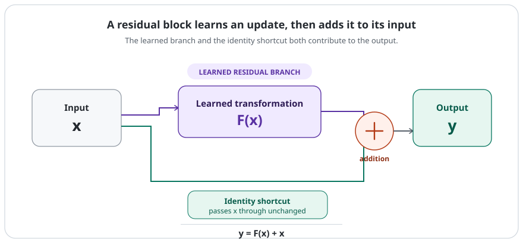
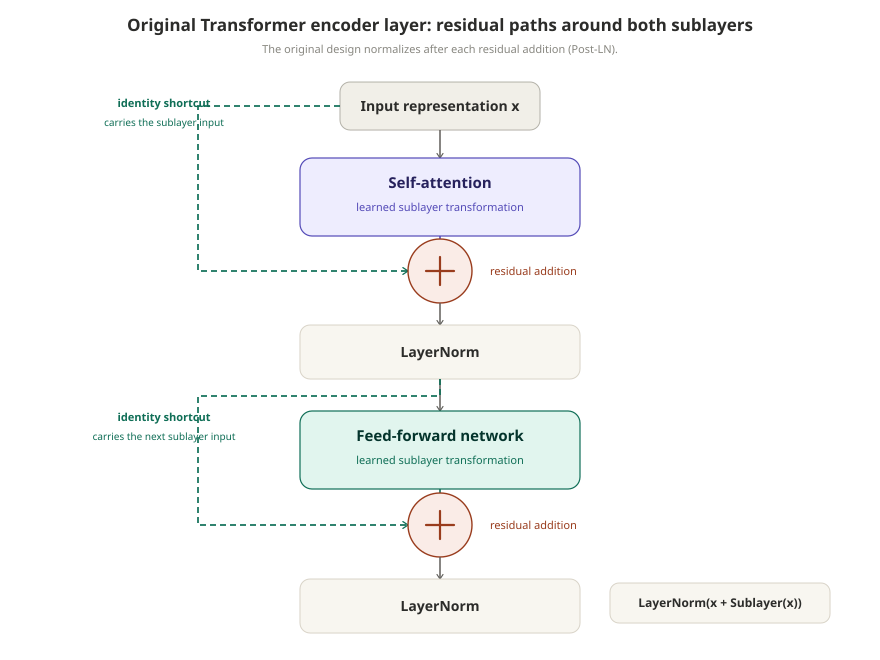

# Residual Connections

[](.)
[](transformers.md)
[](.)
[](https://arxiv.org/abs/1512.03385)

> A residual connection gives a neural-network block a shortcut path, so the block can learn a change to its input instead of having to rebuild the whole representation from scratch.

Residual connections, also called **skip connections**, became widely known through ResNet. They are now a standard part of Transformer blocks and many other deep architectures.

---

## Quick View

| Question | Simple answer |
| --- | --- |
| Core idea | Add a block's input back to its transformed output |
| Basic form | `y = F(x) + x` |
| Shortcut path | `x` |
| Learned branch | `F(x)` |
| Main benefit | Makes very deep networks easier to optimize |
| Popularized by | ResNet |
| Transformer use | Around attention and FFN sublayers |

---

## Learning Flow

```text
deeper network
→ harder optimization
→ preserve a direct path for the input
→ learn a residual transformation F(x)
→ add it back to x
→ stack deep blocks more effectively
→ residual connections become standard in Transformers
```

---

## 1. Why Deeper Is Not Automatically Easier

Adding layers gives a network more capacity, but that does not mean the deeper model is automatically easier to train. The original ResNet paper described a **degradation problem**: as plain networks became deeper, their training error could become worse.

```text
shallower plain network
→ trains successfully

deeper plain network
→ could represent at least the shallower solution
→ but can be harder to optimize
→ training error may become worse
```

This is an optimization problem, not simply the usual story of a larger model overfitting. If training error is already worse, the deeper model has not even fit the training data as well as the shallower one.

Residual learning was introduced as a way to make these very deep networks easier to optimize. The ResNet experiments gave strong empirical evidence for that framing; it is not a claim that every neural-network function is always easier to learn in residual form.

---

## 2. The Basic Residual Idea

An ordinary block tries to learn a complete mapping from its input to its output:

```text
x
↓
neural-network layers
↓
H(x)
```

Residual learning writes the same desired mapping in a different form. If the block wants to produce `H(x)`, its learned branch can instead learn the difference from the input:

```text
F(x) = H(x) - x
```

Then the block output is:

```text
H(x) = F(x) + x

y = F(x) + x
```

The two paths have distinct jobs:

- `x` is the **shortcut** or **skip path**. In the simplest case it passes through unchanged.
- `F(x)` is the learned **residual branch**.
- Their sum combines the existing representation with the transformation the block learned to make.

<p align="center">
  
</p>
<p align="center"><em>The shortcut does not replace the learned branch; the block combines both paths.</em></p>

It is often useful to call `F(x)` a learned *change* or *correction*. That is only intuition: the learned features do not have to correspond to a human-interpretable correction.

---

## 3. What Does “Residual” Mean?

The word **residual** refers to what remains after comparing the desired mapping with the input already available.

```text
current representation
+
learned change
=
updated representation
```

If the input representation is already useful, a block may only need to add or modify some features. The shortcut keeps a direct version of the input available while the residual branch learns that modification.

This does not mean the residual branch is optional or ignored. In a normal residual block, both paths contribute to the output:

```text
transformation: F(x)
shortcut:       x

output:         F(x) + x
```

---

## 4. Why Can This Help Optimization?

### Preserving useful information

Without a residual path, the entire representation must pass through the transformation:

```text
x → F(x)
```

With a residual path, the input has a direct route to the output:

```text
x → F(x) + x
```

That route does not prevent the block from learning a large transformation. It gives the model the option to preserve useful information while adding a learned update.

### A more direct path for gradients

Backpropagation follows the computation graph in reverse. Since the output contains an additive identity path, gradients also have a more direct route through a stack of residual blocks.

For intuition, write the scalar version as:

```text
y = F(x) + x

dy/dx = dF(x)/dx + 1
```

The `+1` comes from differentiating the identity shortcut. This is a simplified scalar view, not the full vector/Jacobian derivation used in real networks. It helps show why signals do not depend only on passing through every learned transformation branch.

Residual connections do **not** completely solve vanishing gradients or guarantee easy training. They provide more direct paths for information and gradients, which is one reason they can make deep networks easier to optimize. The identity-mapping ResNet analysis studied this direct propagation more closely.

---

## 5. What If the Dimensions Do Not Match?

Addition requires compatible shapes.

```text
x       → 256 dimensions
F(x)    → 256 dimensions

F(x) + x → valid
```

If a block changes the representation size, the shortcut can use a projection to match it:

```text
y = F(x) + Wₛx
```

Here, `Wₛ` maps the shortcut input to the needed shape. An identity shortcut has no learned transformation; a projection shortcut does.

---

## 6. Residual Connections in Transformers

Residual connections are one reason repeated Transformer blocks can be stacked deeply. In the original Transformer, each major sublayer has a residual connection around it.

For an encoder block, the broad flow is:

<p align="center">
  
</p>
<p align="center"><em>Each learned sublayer has its own shortcut path; normalization happens after the addition in the original design.</em></p>

The original paper expresses each sublayer as:

```text
LayerNorm(x + Sublayer(x))
```

So the attention output is added to the attention input, and the FFN output is added to the representation entering the FFN. The decoder uses the same pattern around masked self-attention, encoder-decoder attention, and its FFN.

Keeping sublayer inputs and outputs at the same model dimension, `d_model`, makes this addition straightforward.

---

## 7. Residual Connections and LayerNorm Are Different

These operations are often shown together in Transformer diagrams, but they are not the same thing:

```text
residual connection: x + Sublayer(x)

layer normalization: normalize a representation
```

The original Transformer applies normalization after the residual addition:

```text
LayerNorm(x + Sublayer(x))
```

This arrangement is called **Post-LN**. Many later Transformer designs use normalization before a sublayer, often called **Pre-LN**. The normalization placement changes, but the idea of adding a shortcut path is separate from LayerNorm itself.

---

## 8. Common Confusions

| Confusion | Correction |
| --- | --- |
| A residual connection means the layer is skipped | The transformation branch still runs; its result is added to the shortcut path. |
| Residual connection and residual error are the same | Here, residual means a mapping learned relative to the input, not a statistical prediction error. |
| Residual connections solve vanishing gradients | They provide more direct signal and gradient paths, but do not guarantee every gradient problem disappears. |
| The shortcut always has parameters | An identity shortcut has no learned transformation. A projection shortcut can be used when shapes differ. |
| Residual connections belong only to CNNs | They became prominent through ResNet and are also fundamental parts of Transformers. |
| Residual connection and LayerNorm are one operation | They are separate operations, even though Transformer blocks commonly use them together. |

---

## 9. Beyond ResNet

Residual connections became famous through ResNet in computer vision, but the pattern is general:

```text
input
+
learned transformation
```

The learned transformation can be a convolution, attention operation, MLP/FFN, or another neural block. The core idea is not tied to one architecture family.

## Related Papers

- [**Deep Residual Learning for Image Recognition**](https://arxiv.org/abs/1512.03385) — Introduced residual learning for substantially deeper image-recognition networks and framed depth degradation as an optimization issue.
- [**Identity Mappings in Deep Residual Networks**](https://arxiv.org/abs/1603.05027) — Analyzed how identity shortcuts support direct forward and backward signal propagation.
- [**Attention Is All You Need**](https://arxiv.org/abs/1706.03762) — Used residual connections and LayerNorm around every encoder and decoder sublayer in the original Transformer.

## Related Concepts

- [`transformers.md`](transformers.md)
- [`attention.md`](attention.md)
- [`architecture.md`](../papers/nlp-llms/attention-is-all-you-need/architecture.md) — detailed original-paper architecture

---

[](../README.md)
[](./)
[](transformers.md)
[](https://arxiv.org/abs/1512.03385)
