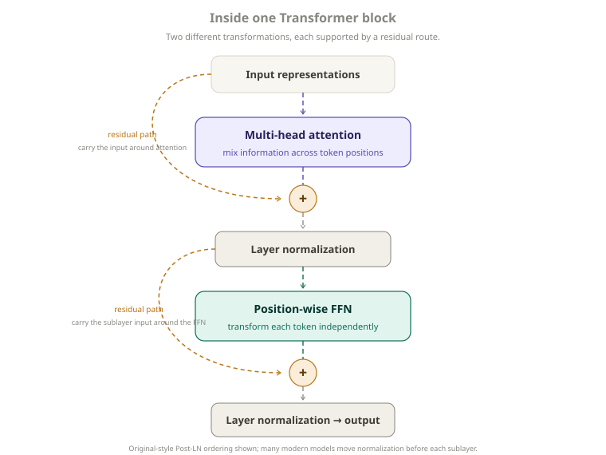
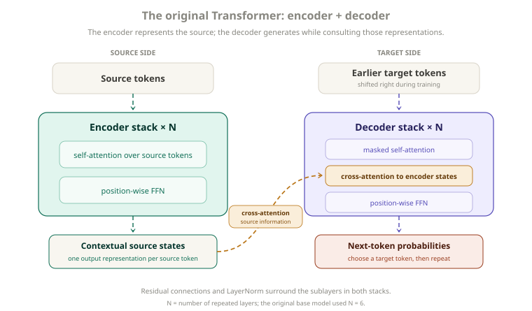
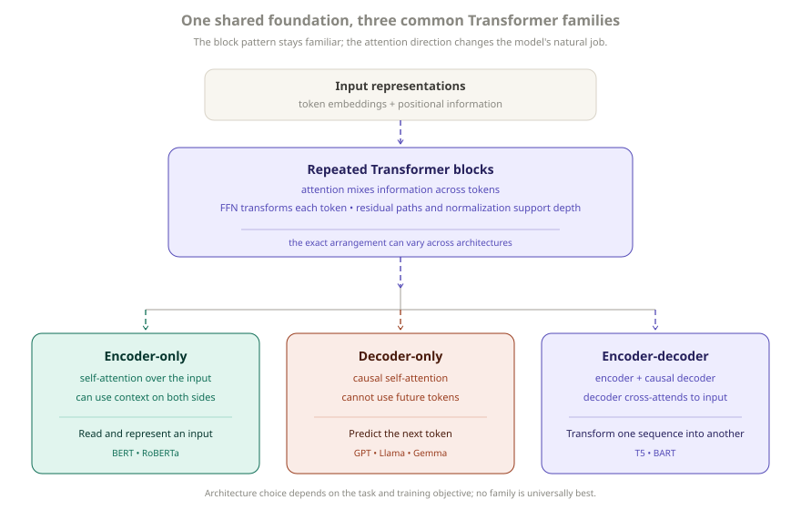

# Transformers

[](.)
[](../papers/nlp-llms/attention-is-all-you-need/architecture.md)
[](.)
[](https://arxiv.org/abs/1706.03762)

> A Transformer is a neural-network architecture that builds contextual token representations mainly through attention, rather than processing a sequence one step at a time with recurrence.

Transformers are a family, not one fixed blueprint. The original 2017 model was an encoder-decoder system for translation; BERT-style encoders, GPT-style language models, and T5-style systems reuse the same central ideas in different arrangements.

---

## Quick View

| Question | Simple answer |
| --- | --- |
| Main idea | Let tokens exchange useful information using attention |
| Introduced | 2017, *Attention Is All You Need* |
| Replaced in the original design | Recurrence and convolution for sequence processing |
| Main building blocks | Attention, FFN, residual paths, normalization |
| Order information | Added separately through positional information |
| Main architecture families | Encoder-only, decoder-only, encoder-decoder |
| Modern LLMs | Usually decoder-only Transformers |

---

## Learning Flow

```text
RNN / LSTM sequence models
→ sequential processing limits parallelism
→ attention becomes a stronger way to connect distant positions
→ Transformer removes recurrence
→ stacked attention-based blocks
→ encoder / decoder variants
→ BERT, GPT, T5, and modern LLM families
```

---

## 1. What Problem Was the Transformer Trying to Solve?

Before Transformers, many sequence models used recurrent neural networks (RNNs) or LSTMs. They processed a sequence in order:

```text
token 1 → token 2 → token 3 → token 4
```

That order is useful, but it creates a practical constraint: each hidden state depends on the one before it. Even during training, the states within a sequence must be computed in order, which limits parallelism across token positions.

Recurrence can also make distant relationships harder to learn. Information from an early word has to pass through many sequential updates before it reaches a far-away word. RNNs and LSTMs were not incapable of using long-range information; long paths simply made the job more difficult.

The Transformer made a different tradeoff:

```text
Instead of passing information token by token,
let tokens interact directly through attention.
```

The original paper proposed a sequence-to-sequence model based on attention rather than recurrence or convolution. This made its training much more parallelizable while still letting a token use information from distant positions.

---

## 2. What Is a Transformer?

A Transformer repeatedly updates a representation for every token. Each token starts with a learned embedding; later representations also reflect the surrounding context.

```text
tokens
↓
token embeddings
+
positional information
↓
Transformer blocks
↓
contextual representations
↓
task-specific output
```

The pieces have separate jobs:

- **Token embeddings** give the model a learned starting representation for each token.
- **Positional information** gives it clues about order, because attention alone does not know which token came first.
- **Transformer blocks** repeatedly let tokens collect context and transform their own representations.
- **Task-specific output** turns the resulting states into, for example, a class label, an embedding, or next-token probabilities.

After several blocks, the representation for a word can be influenced by other relevant words in the sequence. This is called a **contextual representation**. It is not a claim that the model understands language in the human sense.

---

## 3. Inside a Transformer Block

A block is the repeated unit that makes a Transformer deep. The exact order differs across models, but this is the broad idea behind the original design:

<p align="center">
  
</p>
<p align="center"><em>Attention mixes information across positions; the FFN transforms each position, while residual paths preserve a direct route through both sublayers.</em></p>

### Attention: mix information across positions

Attention lets a token draw information from other useful token positions. For example, the representation of `it` can use clues from the noun it refers to. This is the sequence-mixing part of a Transformer.

The important mental model here is *which other positions should help update this one?* The query/key/value calculation and multi-head details belong in [`attention.md`](attention.md).

### Feed-forward network: transform each position

After attention has mixed information between positions, a small feed-forward network (FFN) transforms each position separately. The same learned FFN is applied independently at every position, but each token can produce a different result because it arrives with different contextual information.

```text
Attention: information moves between token positions.

FFN: each position transforms its own representation.
```

### Residual connections: keep an easier route through depth

A residual path adds a block's input back to its transformation:

```text
output = input + transformation(input)
```

This gives information and gradients a more direct route through a stack of many blocks. See [`residual-connections.md`](residual-connections.md) for the intuition and training role.

### Layer normalization: keep stacked computation manageable

Layer normalization helps keep activation scales and training behavior more stable as blocks are stacked. The original Transformer applied it after each residual addition; many later architectures use a different arrangement, often called Pre-LN.

The placement matters for training, but it is a separate topic. See [`layer-normalization.md`](layer-normalization.md).

The FFN design is also intentionally kept high-level here; the planned `feed-forward-networks.md` will cover it in more detail.

---

## 4. Why Positional Information Is Needed

Attention can compare token content, but by itself it does not provide the sequence order that recurrence naturally carries.

<p align="center">
  
</p>
<p align="center"><em>Token identity is not enough: changing the order changes who performs the action.</em></p>

The words are similar, but their order changes who chased whom. Transformers therefore add position information to token representations.

The original Transformer used fixed sinusoidal positional encodings. Later models have used learned positions, relative-position methods, RoPE, ALiBi, and other variants. Those methods answer the same basic need in different ways; [`positional-encoding.md`](positional-encoding.md) explains them without turning this overview into a survey.

---

## 5. The Original Transformer

It helps to separate the original paper from the larger Transformer family. *Attention Is All You Need* introduced an **encoder-decoder Transformer** for sequence-to-sequence tasks such as machine translation.

<p align="center">
  
</p>
<p align="center"><em>The encoder represents the source sequence; the decoder uses those representations while generating the target sequence.</em></p>

The encoder reads the source tokens with self-attention. The decoder generates target tokens and uses two kinds of information: earlier target tokens through masked self-attention, and the encoder's source representations through encoder-decoder attention (also called cross-attention).

The original base model had six encoder layers, six decoder layers, `d_model = 512`, eight attention heads, and `d_ff = 2048`. These are historical paper settings, not requirements for calling a model a Transformer. For the complete original layout, see [`architecture.md`](../papers/nlp-llms/attention-is-all-you-need/architecture.md).

---

## 6. Three Transformer Families

<p align="center">
  
</p>
<p align="center"><em>The core block idea stays familiar, while the direction of attention changes what the model is naturally suited to do.</em></p>

### Encoder-only: represent the whole input

```text
tokens
↓
encoder blocks
↓
contextual representations
↓
classification / token prediction / embeddings / other heads
```

Encoder self-attention can generally use tokens on both sides of a position. A helpful mental model is: **read the whole input, then build useful representations of it.** BERT and RoBERTa are common examples. This form is naturally useful for classification, named-entity recognition, extractive tasks, and representation or embedding systems.

### Decoder-only: predict what comes next

```text
previous tokens
↓
causal Transformer blocks
↓
next-token probabilities
↓
next token
↓
repeat
```

Decoder-only models use **causal** (masked) self-attention. At position `t`, a token can use the current and earlier positions, but not future ones:

```text
token 1 → can see token 1
token 2 → can see tokens 1–2
token 3 → can see tokens 1–3
token 4 → can see tokens 1–4
```

That restriction matches autoregressive next-token prediction, so the same model can generate a continuation one token at a time. GPT, Llama, and Gemma families are examples. Most modern general-purpose LLMs use this form because next-token training and left-to-right generation fit directly together; it is not the only useful Transformer architecture.

### Encoder-decoder: transform one sequence into another

```text
input sequence
      ↓
    encoder
      ↓
input representations
      ↓
    decoder
      ↓
output sequence
```

The decoder combines causal self-attention over the output generated so far with cross-attention to the encoder's input representations. This is a natural shape for translation, summarization, and other text-to-text tasks. T5 and BART are well-known examples.

---

## 7. Comparing the Families

| Architecture | Main attention behavior | Best mental model | Examples |
| --- | --- | --- | --- |
| Encoder-only | Self-attention over the input, often using both directions | Understand or represent input | BERT, RoBERTa |
| Decoder-only | Causal self-attention over earlier/current tokens | Predict what comes next | GPT, Llama, Gemma |
| Encoder-decoder | Encoder self-attention + causal decoder + cross-attention | Transform one sequence into another | T5, BART |

None is universally better. The architecture, training objective, data, and task need to fit together.

---

## 8. What Actually Makes It a Transformer?

“Transformer” does not mean only attention, exactly the 2017 architecture, six layers, eight heads, sinusoidal positions, or an encoder-decoder model.

```text
Transformer family
=
stacked attention-based blocks
+
token-wise transformations
+
residual pathways
+
normalization
+
some way to represent position or order
```

Specific models vary the encoder/decoder structure, positional method, normalization placement, FFN design, attention implementation, depth, width, number of heads, and context length. The shared pattern is more important than any one historical configuration.

---

## Limitations

- Standard self-attention becomes expensive as sequence length grows because it computes scores across pairs of token positions.
- Position handling helps represent order, but it does not guarantee reliable use of very long contexts.
- A Transformer architecture alone does not determine a model's knowledge, reliability, or behavior; training data, objective, scale, and evaluation matter too.

---

## Related Papers

- [**Attention Is All You Need**](https://arxiv.org/abs/1706.03762) — Introduced the attention-based encoder-decoder Transformer without recurrence or convolution.
- [**BERT: Pre-training of Deep Bidirectional Transformers for Language Understanding**](https://arxiv.org/abs/1810.04805) — Established a widely used encoder-only Transformer approach to language representations.
- [**Exploring the Limits of Transfer Learning with a Unified Text-to-Text Transformer**](https://arxiv.org/abs/1910.10683) — Presented T5's encoder-decoder text-to-text framework.
- [**Language Models are Few-Shot Learners**](https://arxiv.org/abs/2005.14165) — Described GPT-3 as a large autoregressive language model.

## Related Concepts

- [`attention.md`](attention.md)
- [`positional-encoding.md`](positional-encoding.md)
- [`residual-connections.md`](residual-connections.md)
- [`layer-normalization.md`](layer-normalization.md)
- [`feed-forward-networks.md`](feed-forward-networks.md)
- [`architecture.md`](../papers/nlp-llms/attention-is-all-you-need/architecture.md) — detailed original-paper architecture

## Questions Worth Testing

- How does scaled attention change as the query/key dimension grows?
- Which positional methods best preserve order learning beyond the lengths seen during training?
- How does LayerNorm placement affect training stability in a small Transformer?

---

[](../README.md)
[](./)
[](attention.md)
[](../papers/nlp-llms/attention-is-all-you-need/architecture.md)
