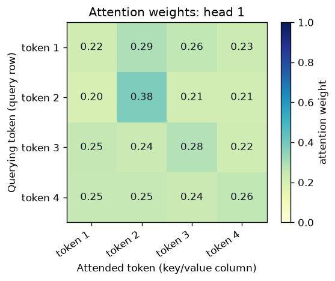
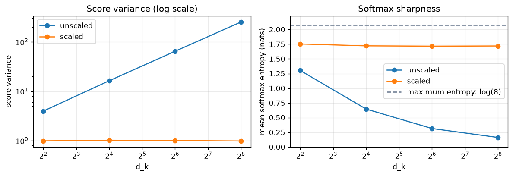
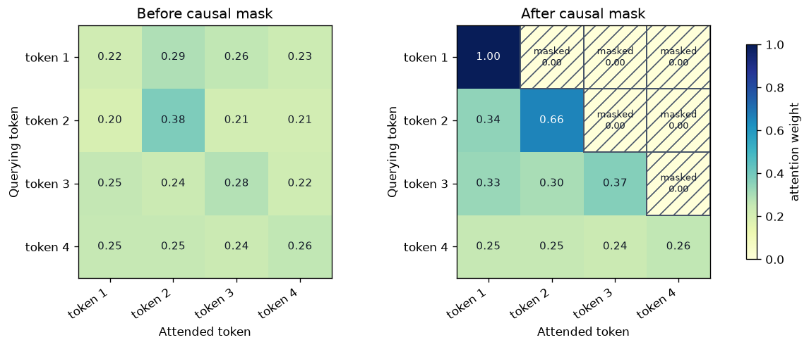

# Attention From Scratch

A small, beginner-friendly PyTorch experiment that turns the attention equation into direct code. It is a synthetic forward-pass study, not a trained Transformer or a research result.

## Research question

How do input vectors become attention-weighted output vectors, and what do scaling, causal masking, and multiple heads change in that calculation?

## Hypothesis

Raw dot-product scores should grow with `d_k`. Dividing by `√d_k` should keep their scale more stable, while a causal mask applied before softmax should give every future position zero weight.

## Related notes

- [Attention](../../concepts/attention.md)
- [Transformers](../../concepts/transformers.md)
- [Attention mechanics in *Attention Is All You Need*](../../papers/nlp-llms/attention-is-all-you-need/attention-mechanics.md)

## Setup

The [notebook](attention-from-scratch.ipynb) uses a deterministic four-token synthetic input with `d_model = 8`, two heads, and `d_head = 4`. It implements `nn.Linear` Q/K/V projections and basic PyTorch tensor operations only—never `nn.MultiheadAttention`.

It traces:

```text
X → Q/K/V → QKᵀ → /√d_k → softmax → attention weights → weighted sum of V
```

The notebook then compares unscaled and scaled random scores for `d_k = 4, 16, 64, 256`, applies a lower-triangular causal mask, and concatenates two head outputs before an output projection.

## Observations

In the recorded deterministic run, raw-score variance rose from `3.966` at `d_k = 4` to `252.116` at `d_k = 256`; scaled-score variance stayed near `1` (`0.992` to `0.985`). Unscaled mean softmax entropy fell from `1.302` to `0.162` nats, while scaled entropy remained near `1.72` nats. The causal-mask check reported a largest future-token weight of exactly `0.0`, and each attention row summed to one.

### How to read the figures

**Attention-weight heatmap:** read across one row. That row's token is the query; each column is a token whose value could contribute to the query's output. Darker cells and the two-decimal annotations mean more attention. The numbers in every row add to one.

**Scaling comparison:** the left panel uses a logarithmic variance axis so the stable scaled values near `1` remain visible next to the growing raw-score variance. In the right panel, higher entropy means attention is distributed more evenly across keys. The dashed `log(8)` line is the maximum possible entropy when a query can choose among eight keys.

**Causal-mask comparison:** the left panel allows every token to attend everywhere. In the right panel, hatched `masked 0.00` cells are future tokens. They are excluded before softmax, so their weight is exactly zero—not merely small.

These weights come from untrained random projections, so they demonstrate the mechanics of attention rather than language behavior.







## Interpretation

In this controlled simulation, scaling prevents larger key/query dimensions from making the softmax distribution sharply concentrated. Causal masking blocks information from later positions before normalization. Multiple heads repeat the same calculation in smaller representation subspaces, then recombine their outputs; this experiment does not establish specialized roles for heads.

## Limitations

- The projections are untrained and the tokens are synthetic.
- This isolates attention from positional information, residual connections, normalization, feed-forward networks, and optimization.
- It does not train, evaluate, or explain a Transformer model.

## Reproduce

Use a separate Python 3.11 virtual environment from this directory:

```bash
python3.11 -m venv .venv
source .venv/bin/activate
pip install -r requirements.txt
jupyter execute attention-from-scratch.ipynb --inplace --timeout=120
```

The final command reruns every notebook cell, updates the recorded outputs, and regenerates the PNG files in `figures/`.
