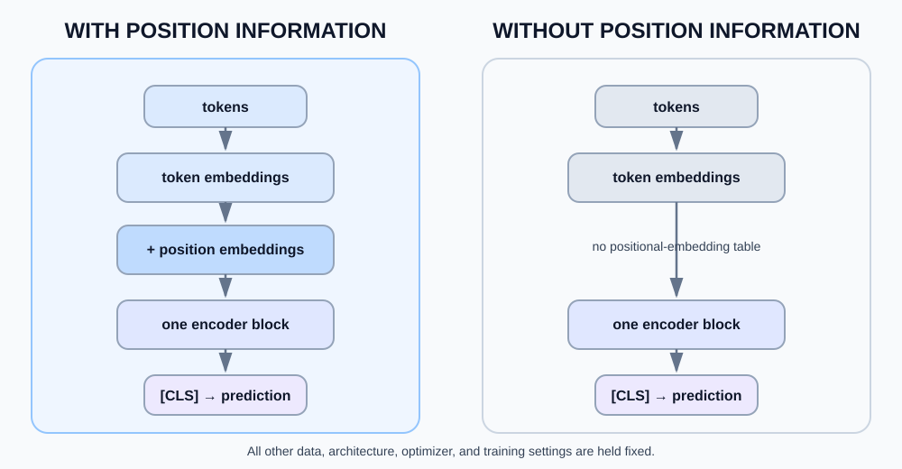
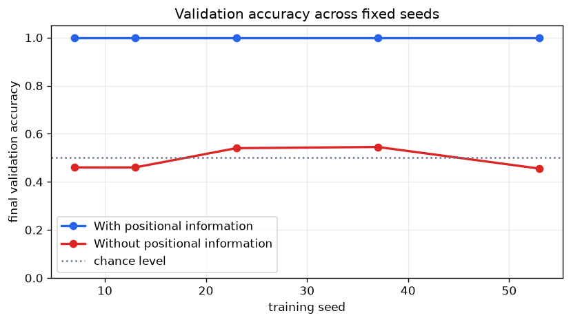
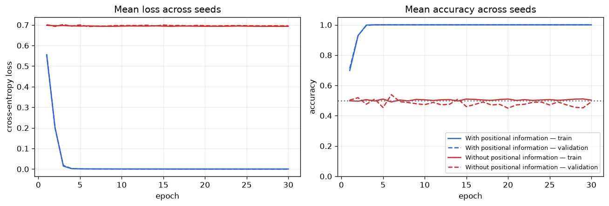

# Positional Information Ablation

A small controlled comparison of the existing Tiny Transformer classifier with and without learned positional embeddings.

## Research question

What changes when positional information is removed from a Transformer that must classify whether `A` appears before `B`?

## Hypothesis

The model with learned positional embeddings should learn the order rule. Without them, the model should remain near chance because each class has the same token identities and counts.

## Setup and controls

Each seven-token input starts with `[CLS]`, followed by exactly one `A`, one `B`, and four filler tokens. Label `1` means `A` appears before `B`; label `0` means `B` appears before `A`.

The notebook generates one seeded set of 1,000 unique, balanced sequences and uses a disjoint 800/200 train/validation split. Both conditions use the same data, one encoder block, `d_model=32`, four heads, a `32 → 64 → 32` FFN, `[CLS]` classification, AdamW (`lr=0.003`, `weight_decay=0.0001`), batch size 64, and 30 epochs. The only changed component is the learned positional-embedding table.



## Results

The five fixed training seeds were `7`, `13`, `23`, `37`, and `53`. These are the actual final validation accuracies recorded by the executed notebook.

| Condition | Mean validation accuracy | Std |
| --- | ---: | ---: |
| With positional information | 1.000 | 0.000 |
| Without positional information | 0.492 | 0.046 |

The positional condition reached perfect validation accuracy in every run. The no-position condition ended between `0.455` and `0.545`, near the balanced-task chance level of `0.500`. Its losses stayed near cross-entropy for an uncertain binary prediction, while the positional condition's training and validation losses fell close to zero.





## Interpretation

On this controlled task, token identity and count are not enough to recover the label. Adding learned position vectors gives the encoder a way to distinguish whether `A` comes before or after `B`; removing them removes that signal while leaving the rest of the model unchanged.

## Limitations

- This is a small synthetic classification task, not a language-understanding benchmark.
- It compares learned absolute positions with no positional information; it does not compare sinusoidal encodings, relative positions, RoPE, or ALiBi.
- The result demonstrates this architecture and task setting, not a general claim about all models or sequence problems.

## Related notes

- [Transformers](../../concepts/transformers.md)
- [Positional encoding](../../concepts/positional-encoding.md)
- [Tiny encoder-only Transformer](../tiny-transformer/)
- [Attention from scratch](../attention-from-scratch/)

## Reproduce

Use Python 3.11 and a virtual environment from this directory:

```bash
python3.11 -m venv .venv
source .venv/bin/activate
pip install -r requirements.txt
jupyter-nbconvert --to notebook --execute --inplace positional-information.ipynb --ExecutePreprocessor.timeout=180
jupyter-nbconvert --to html positional-information.ipynb
```
