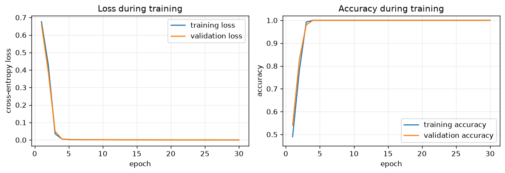

# Tiny Encoder-Only Transformer

A small, end-to-end PyTorch experiment that trains one encoder-only Transformer block to classify whether `A` appears before `B` in a synthetic sequence.

## What I wanted to understand

How do token embeddings, learned positional embeddings, multi-head self-attention, residual paths, LayerNorm, an FFN, `[CLS]` pooling, and a classifier become one working model?

## Task and model

Each seven-token input starts with `[CLS]`, followed by exactly one `A`, one `B`, and four independently sampled filler tokens. The label is `1` when `A` occurs before `B` and `0` otherwise. Token counts are identical across classes, so order is the useful signal.

```text
tokens → token embeddings + positional embeddings → one encoder block
→ final [CLS] representation → classifier → prediction
```

The notebook uses 1,000 seeded examples with an 800/200 train/validation split, a `d_model` of 32, four attention heads, and one `32 → 64 → 32` FFN. It has no test set, padding, mask, or ablation: all sequences have the same length and encoder attention can use the whole input.

## Observed results

In the recorded deterministic run, validation accuracy was `0.680` after epoch 1 and reached `1.000` by epoch 5, remaining there through epoch 30. Final validation loss was `0.0002`.

### How to read the figure

The left panel shows cross-entropy loss; lower values mean the model assigns more probability to the correct class. The right panel shows accuracy. Training and validation curves are shown together so the small run can be checked for both learning and divergence.



## Related notes

- [Attention](../../concepts/attention.md)
- [Transformers](../../concepts/transformers.md)
- [Positional encoding](../../concepts/positional-encoding.md)
- [Residual connections](../../concepts/residual-connections.md)
- [Layer normalization](../../concepts/layer-normalization.md)
- [Feed-forward networks](../../concepts/feed-forward-networks.md)
- [Attention from scratch](../attention-from-scratch/)

## Limitations

- This deliberately easy synthetic task is not a language-understanding benchmark.
- Success here shows that this small setup can learn this controlled order rule; it does not establish how larger Transformers reason.
- The notebook does not use attention weights as a full explanation of individual predictions.

## Reproduce

Use Python 3.11 and a separate virtual environment from this directory:

```bash
python3.11 -m venv .venv
source .venv/bin/activate
pip install -r requirements.txt
jupyter-nbconvert --to notebook --execute --inplace tiny-transformer.ipynb --ExecutePreprocessor.timeout=120
jupyter-nbconvert --to html tiny-transformer.ipynb
```
