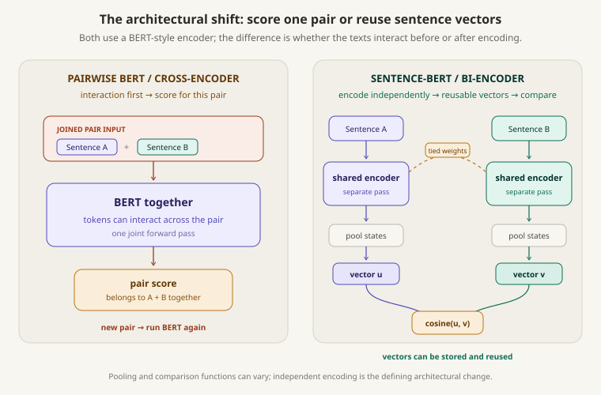

# Sentence-BERT

[](.)
[](../../../concepts/embedding-models-and-bi-encoders.md)
[](.)
[](https://aclanthology.org/D19-1410/)

> Sentence-BERT was an important early architecture for modern text-embedding systems: it made BERT-style encoders practical for reusable semantic-search vectors. It did not invent embeddings, and it does not replace the detailed pairwise judgment of a cross-encoder.

## Paper Snapshot

| Item | Details |
| --- | --- |
| **Paper** | *Sentence-BERT: Sentence Embeddings using Siamese BERT-Networks* |
| **Authors** | Nils Reimers and Iryna Gurevych |
| **Venue** | EMNLP-IJCNLP 2019 |
| **Base models** | Pretrained BERT and RoBERTa, then fine-tuned |
| **Core change** | Shared-weight siamese or triplet structure plus pooling for one vector per sentence |
| **Main use** | Semantic textual similarity, clustering, and semantic search |
| **Central tradeoff** | Reusable vectors and cheap comparison, but no joint token-level interaction during encoding |
| **Related concepts** | [Embeddings and bi-encoders](../../../concepts/embedding-models-and-bi-encoders.md), [contrastive learning](../../../concepts/contrastive-learning.md), [rerankers and cross-encoders](../../../concepts/rerankers-and-cross-encoders.md) |

## The Problem SBERT Was Solving

BERT was already strong on sentence-pair tasks when both texts were passed through the model together. That is useful when a model needs to judge one known pair. It is a poor fit for searching a large collection, because every new pairing needs another joint BERT forward pass.

The paper gives a concrete scale illustration. To find the most similar pair among 10,000 sentences, a pairwise BERT setup needs about 50 million pair evaluations. On the paper's stated V100 setup, the authors report roughly 65 hours for BERT/RoBERTa. With SBERT, computing the 10,000 sentence embeddings takes about 5 seconds, followed by roughly 0.01 seconds for the cosine-similarity comparisons. These are historical measurements from that setup, not universal latency guarantees.

## The One-Line Idea

```text
Fine-tune a shared BERT encoder so each sentence becomes a useful standalone vector,
then compare vectors later instead of jointly encoding every possible pair.
```

The architecture changes *when* the texts meet. A cross-encoder lets tokens interact first and returns a score for that one pair. SBERT encodes each sentence separately, pools each token sequence into a vector, and compares the vectors afterward.

<p align="center">
  
</p>
<p align="center"><em>The important shift is from a pair-dependent score to independently created representations that can be reused.</em></p>

## From Pairwise BERT to Independent Sentence Embeddings

A BERT-style cross-encoder can read both sentences as one joined input. Its hidden states can use information from both sides, which makes the final score specific to the pair:

```text
pair score = g(sentence A, sentence B)
```

SBERT instead applies the same encoder weights to each input in separate passes:

```text
u = f(sentence A)
v = f(sentence B)
similarity = cosine(u, v)
```

“Siamese” here means the two encoder branches have tied weights; it does **not** mean that their token states interact across sentences. The general [embedding-model and bi-encoder note](../../../concepts/embedding-models-and-bi-encoders.md) explains that architecture in more detail. Here, the paper's contribution is using it to make a pretrained BERT-style encoder produce useful sentence-level representations.

## Pooling: Token States to One Sentence Vector

BERT produces one contextual state per token. SBERT adds a pooling operation to turn those token states into a fixed-size sentence vector. The paper experiments with:

| Pooling strategy | Paper description |
| --- | --- |
| **CLS** | Use the final state of the `[CLS]` token |
| **MEAN** | Average the output token vectors |
| **MAX** | Take the maximum value across token states in each dimension |

Mean pooling is the paper's default configuration. That choice is not a general rule: the right pooling method depends on the training objective and model. The paper is especially useful here because it shows why simply taking an arbitrary BERT `[CLS]` state—or averaging unadapted BERT outputs—does not automatically create a strong sentence embedding. The fine-tuning signal has to teach the pooled vector what relationships it should preserve.

## How SBERT Trains the Representation

The authors choose the network structure and loss according to the available data. These are the paper's three formulations, not a complete survey of later embedding losses.

| Data and objective | How the pooled vectors are used |
| --- | --- |
| **NLI classification** | Concatenate `(u, v, \|u - v\|)`, apply a learned softmax classifier, and optimize cross-entropy for entailment, contradiction, or neutral labels. |
| **STS regression** | Compute `cosine(u, v)` and minimize mean-squared error against the annotated similarity score. |
| **Triplet objective** | Make an anchor closer to its positive than to its negative by a margin; the paper uses Euclidean distance and margin `1`. |

The paper trains its NLI model on SNLI and MultiNLI. It also uses the STS Benchmark for supervised similarity regression and Wikipedia-section triplets for the triplet setting. These objectives reshape the encoder and pooling output so vector distance carries a task-relevant signal; cosine similarity reads that learned geometry, rather than creating it by itself.

For the broader vocabulary of positive pairs, negatives, and representation geometry, see [contrastive learning](../../../concepts/contrastive-learning.md). That note covers a broader family of training ideas than the 2019 SBERT paper.

## How Inference Changes After Training

After training, each sentence can be encoded once:

```text
corpus documents → SBERT → stored vectors
new query        → SBERT → query vector
query vector + stored vectors → similarity search → candidates
```

The same document vector can be compared with many queries without rerunning the document through the encoder. This changes the costly model work from “one forward pass per pair” to “one forward pass per text,” followed by much cheaper vector comparisons. In a large system, those vectors may be indexed for approximate nearest-neighbor search; that indexing detail is a later systems choice, not part of the paper's architecture claim.

## What the Paper Evaluated

The evaluation is wider than one similarity benchmark. The paper reports:

| Evaluation | What it checks |
| --- | --- |
| **Unsupervised STS** | Spearman rank correlation between cosine similarities and human similarity labels across STS12–STS16, STS Benchmark, and SICK-R |
| **Supervised STS Benchmark** | Similarity quality after training on STS data, compared with a BERT cross-encoder and sentence-embedding baselines |
| **Argument Facet Similarity** | Similarity between argumentative statements, including a stricter cross-topic setting |
| **Wikipedia-section triplets** | Whether an anchor is closer to its positive than its negative after triplet training |
| **SentEval transfer tasks** | How useful fixed sentence embeddings are as features for simple downstream classifiers |
| **Computational efficiency** | Sentence-embedding throughput and the practical contrast with repeated pairwise encoding |

Two result patterns matter more than a long leaderboard. First, on the paper's unsupervised STS average, SBERT-NLI-large reaches `76.55` Spearman points versus `54.81` for averaged BERT embeddings and `29.19` for BERT's CLS vector. Second, on supervised STS Benchmark, the cross-encoder remains slightly stronger in the paper's NLI-plus-STS large setup (`88.77` versus `86.10`), while SBERT keeps its retrieval-scale inference advantage. The comparison is a tradeoff, not a universal winner.

## What I Learned from the Results

The paper makes the architecture-performance tradeoff concrete. BERT was not made unhelpful by being a cross-encoder; it was highly effective at using pairwise interaction. The issue was that its output was tied to a particular pair, so evaluating a huge candidate set meant repeating that expensive interaction again and again.

SBERT's result is compelling because it keeps a strong pretrained encoder, then changes the training and output shape so the resulting vectors are useful by themselves. The paper's supervised STS comparison is also an important warning: independent embeddings buy scale, but they can give up some pair-specific precision.

## Strengths

- Reuses pretrained BERT/RoBERTa rather than training a sentence encoder from scratch.
- Makes semantic-search, clustering, and all-pairs similarity much more practical.
- Tests multiple pooling strategies and training formulations instead of assuming one is best.
- Evaluates both representation quality and computational consequences.
- Provides a clear architectural bridge from contextual token states to reusable sentence vectors.

## Limitations

- Each text is compressed before comparison, so SBERT cannot form cross-text token interactions while encoding a pair.
- The reported speed measurements depend on the paper's models, hardware, batching, sequence lengths, and comparison setup.
- NLI, STS, and Wikipedia-section relationships do not cover every retrieval task or domain.
- The paper's models and benchmarks predate many later embedding objectives, retrieval benchmarks, and encoder architectures.
- A high cosine similarity is only meaningful relative to the data and objective that trained the embedding space.

## How This Connects to Retrieval and Reranking

A useful modern system pattern follows from this tradeoff, although this retrieve-then-rerank pipeline is not an experiment from the 2019 SBERT paper:

```text
query
→ SBERT-style embedding retrieval finds a manageable candidate set
→ cross-encoder reranker jointly scores each candidate pair
→ final ranking
```

SBERT supports broad, reusable candidate retrieval. A [cross-encoder reranker](../../../concepts/rerankers-and-cross-encoders.md) can then spend more computation on the smaller set where query-document interaction matters. The next experiment can test that handoff directly: compare lexical or embedding retrieval with cross-encoder reranking, while remembering that reranking cannot recover a relevant document that retrieval never returned.

Modern [Sentence Transformers](https://sbert.net/docs/sentence_transformer/usage/semantic_textual_similarity.html) documentation uses the same practical pattern of encoding texts and comparing their representations. Its current library supports many model families, objectives, and similarity functions; it is useful modern context, not evidence for the paper's 2019 results.

## My Takeaway

Sentence-BERT changed my mental model of an encoder from “a model that must read the pair it will judge” to “a model that can be trained to produce a reusable representation of one text.”

The key is not cosine similarity alone, and not a special pooling trick alone. It is the combination:

```text
pretrained contextual encoder
→ pooling
→ training signal that shapes sentence-level geometry
→ independent vectors that are cheap to compare later
```

That combination explains why SBERT is an important foundation for modern embedding retrieval, while also explaining why cross-encoders remain valuable when a system needs close pairwise inspection.

## References

- [Reimers and Gurevych (2019), *Sentence-BERT: Sentence Embeddings using Siamese BERT-Networks*](https://aclanthology.org/D19-1410/) — primary paper, PDF, citation record, and reported results.
- [Official Sentence Transformers repository](https://github.com/huggingface/sentence-transformers) — maintained implementation and modern embedding/reranking context.
- [Official Sentence Transformers semantic textual similarity documentation](https://sbert.net/docs/sentence_transformer/usage/semantic_textual_similarity.html) — current terminology and embedding-comparison usage.

---

[](../../../README.md)
[](../../)
[](../../../concepts/embedding-models-and-bi-encoders.md)
[](../../../concepts/rerankers-and-cross-encoders.md)
